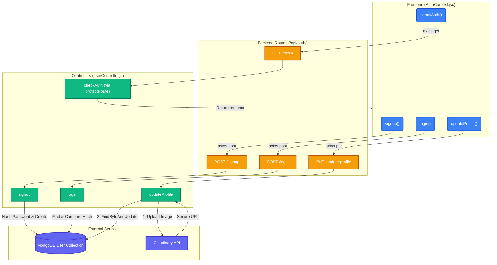
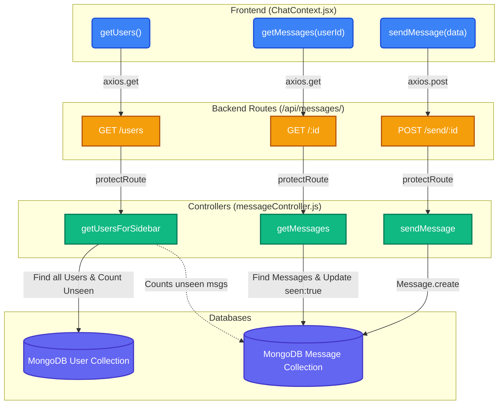
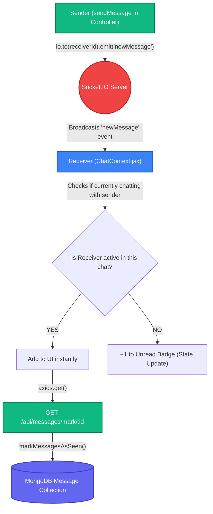

# 🌟 ChatApp Architecture & Flow Map

This document serves as the master blueprint of your ChatApp. It maps every frontend function to its corresponding API route, backend controller, database action, and Socket.IO real-time event.

To make the architecture easy to read and understand, the complete system has been broken down into three focused flow diagrams.

---

## 🔐 1. Authentication & Profile Flow

This diagram covers how users sign up, log in, maintain their session on refresh, and update their profile.

---

## 💬 2. Messaging & Sidebar Flow

This diagram maps how the app fetches the users list (with unread badges) and how users send and fetch messages.

---

## 🚀 ⚡ 3. Real-Time Socket.IO Flow

This diagram illustrates how a newly sent message triggers real-time events to the receiver.

---

## 🗂️ Route to Function Quick Reference Table

| Frontend Action / Function | API Method & Route | Backend Controller Function | What Database/Service Does it Hit? |
| :--- | :--- | :--- | :--- |
| `login()` | `POST /api/auth/login` | `login` | MongoDB: `User.findOne()`, bcrypt comparison |
| `signup()` | `POST /api/auth/signup` | `signup` | MongoDB: `User.create()`, bcrypt hashing |
| `checkAuth()` | `GET /api/auth/check` | `checkAuth` | Uses `protectRoute` middleware (JWT Decode) |
| `updateProfile()` | `PUT /api/auth/update-profile` | `updateProfile` | Cloudinary Upload -> MongoDB: `User.findByIdAndUpdate()` |
| `getUsers()` | `GET /api/messages/users` | `getUsersForSidebar` | MongoDB: `User.find()`, multiple `Message.find()` |
| `getMessages(userId)` | `GET /api/messages/:id` | `getMessages` | MongoDB: `Message.find()`, `Message.updateMany()` |
| `sendMessage(data)` | `POST /api/messages/send/:id` | `sendMessage` | Cloudinary Upload -> MongoDB: `Message.create()` -> Socket.IO |
| (Auto on new msg) | `GET /api/messages/mark/:id` | `markMessagesAsSeen`| MongoDB: `Message.findByIdAndUpdate()` |
