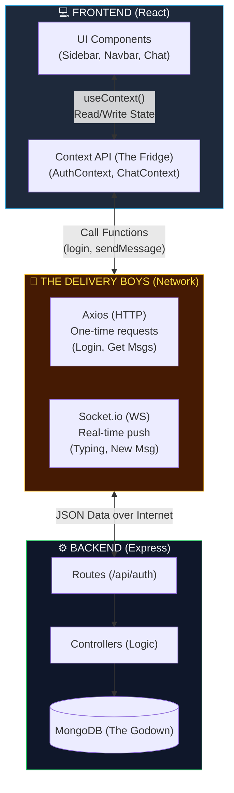
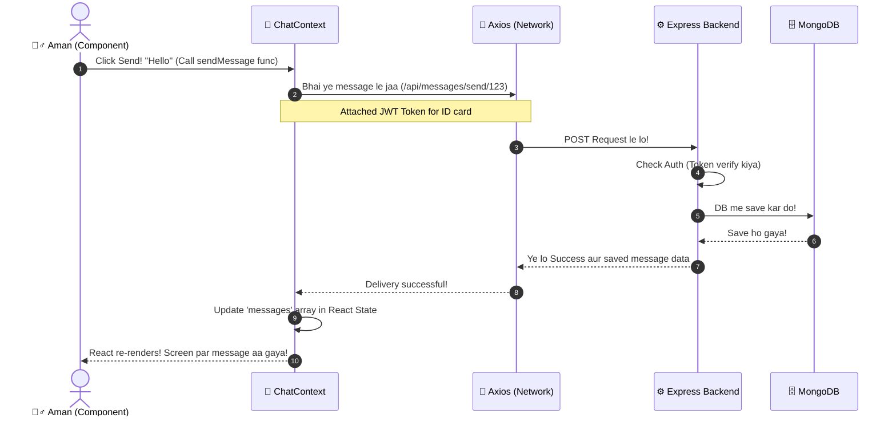

# 🌟 11. Frontend-Backend Connection (The Senior Developer Masterclass)

Bhai, sun! Mai samajh gaya tera confusion kahan aa raha hai. Jab koi pehli baar full-stack banata hai, toh sabse bada gap yahi aata hai ki *"Bhai ye React (Frontend) aur Express (Backend) aapas mein baatein kaise kar rahe hain? Aur ye Context kya bala hai?"*

Main ek **12-year experienced Senior Full Stack Developer** ke nazariye se tujhe hinglish mein step-by-step samjhata hu. Ghabra mat, ek baar concept click ho gaya toh tu kisi bhi language/framework me app bana lega!

---

## 🛑 Sabse Bada Myth: "Context Backend se connect karta hai"
Bohot log sochte hain ki React ka `Context` (jaise `AuthContext`) backend se direct judta hai. **Nahi!**

### 📌 Asliyat kya hai?
- 💡 **Backend (Node.js/Express):** Ek dukaandaar hai jiske paas saara data (MongoDB) pada hai.
- 💡 **Frontend (React Components):** Ek customer hai jisko display karna hai.
- 💡 **Axios & Socket.io:** Ye dono **Delivery Boys** (Zomato/Swiggy) hain, jo dukaandaar se saman laakar customer ko dete hain.
- 💡 **Context API:** Ye tere ghar ka **Fridge (Global State)** hai!

Jab delivery boy (Axios) backend se data (User Profile) le aata hai, toh tu har room (Components like Sidebar, Chat, Navbar) me jaa kar data nahi baant-ta. Tu usko **Context (Fridge)** me rakh deta hai. Ab jis room (Component) ko jo chahiye, wo direct Fridge se nikal leta hai!

---

## 🎨 Diagram 1: The Core Connection Flow

---

## 🔍 Detail me Samjhte Hain

### 📌 1. React Components (The UI)
React ke paas dimaag nahi hota ki data kahan se lana hai. Uska ek hi kaam hai: **"Jo data mile, usko screen par sundar dikhao."**
Tere app mein `Sidebar.jsx` ko saare online users dikhane hain. Wo direct backend ko call nahi karta. Wo `AuthContext` ko bolta hai *"Bhai mujhe online users de!"*

### 📌 2. Context API (The Global State Manager)
Agar Context nahi hota, toh tujhe data `App.jsx -> HomePage.jsx -> ChatContainer.jsx -> MessageList.jsx` aise ek ek karke (Prop Drilling) bhejna padta. 
Context ek **umbrella** ki tarah kaam karta hai. Jo data `AuthContext` ke paas aa gaya, us umbrella ke neeche khada koi bhi component usko seedha access kar sakta hai.

**AuthContext.jsx kya karta hai?**
1. Ye **Delivery Boys (Axios/Socket)** ko bhejta hai backend ke paas.
2. Jab data (User details, token, online array) aata hai, toh usko apne paas save kar leta hai (`setAuthUser`, `setOnlineUsers`).
3. Poore app me us data ko batta hai (provide karta hai).

### 📌 3. Axios (HTTP REST) - The "Request/Response" Boy
Jab tujhe ek baar data lana hai (jaise Login karna, ya kisi chat ki history kholna), tab tu **Axios** use karta hai. 
- Tu backend ko call karta hai: *"Ye le Email/Pass, mujhe Token de."*
- Backend Token deta hai. Connection band. Kaam khatam. 
- Axios har request ke sath **JWT Token** ko header mein chipka kar bhejta hai taaki backend pehchaan sake ki tu kaun hai (`api.defaults.headers.common["token"]`).

### 📌 4. Socket.io (WebSocket) - The "Live Wire" Boy
Jab tujhe **real-time** data chahiye (jaise WhatsApp me Typing... dikhta hai), tu baar-baar Axios se backend ko tang nahi kar sakta. 
Tu **Socket.io** ka ek pipe (Persistent connection) jod deta hai backend ke sath.
- Jab bhi kisi ne naya message bheja, Backend is pipe ke through turant frontend ko awaaz marta hai: *"Bhai naya message aaya hai, isko ChatContext me daal de!"*
- Frontend usko sunta hai (`socket.on('newMessage')`) aur turant React state update karke UI refresh kar deta hai.

---

## 🎨 Diagram 2: Ek Message Bhejne ki Asli Kahaani

Maan le Aman (Frontend) Rahul ko "Hello" bhej raha hai. Ye kaam frontend aur backend connect hoke kaise karte hain:

**Summary of Connection:**
1. **Action:** User button dabata hai (React Component).
2. **Context Method:** Component Context ki function call karta hai (e.g. `sendMessage`).
3. **API Call:** Context function ke andar Axios use hota hai backend route hit karne ke liye.
4. **Backend Logic:** Express us route par baitha function (Controller) chalata hai, DB se baat karta hai, aur JSON wapas karta hai.
5. **State Update:** JSON wapas aakar Context ki React State (`useState`) me save hota hai.
6. **Re-render:** Jaise hi state badli, React screen update kar deta hai. 

Bas yahi loop poore project me baar-baar chal raha hai! Frontend Context me state rakhta hai, aur Axios/Socket se backend ko sync karta rehta hai.
