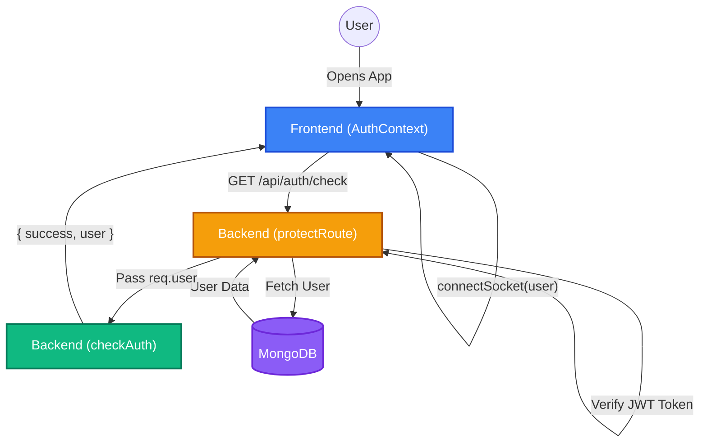
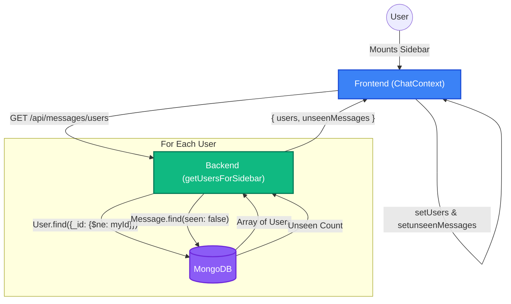
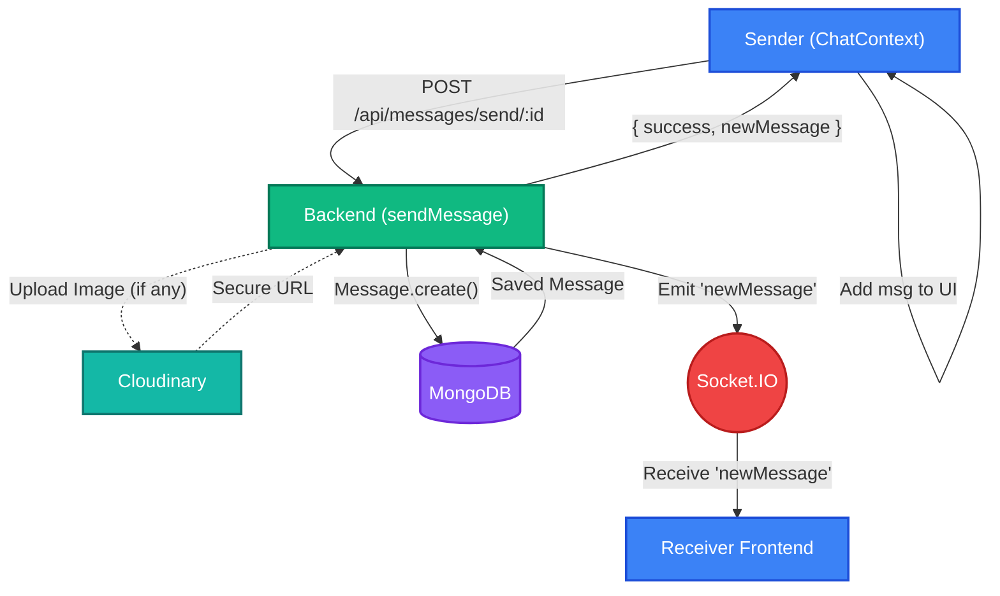
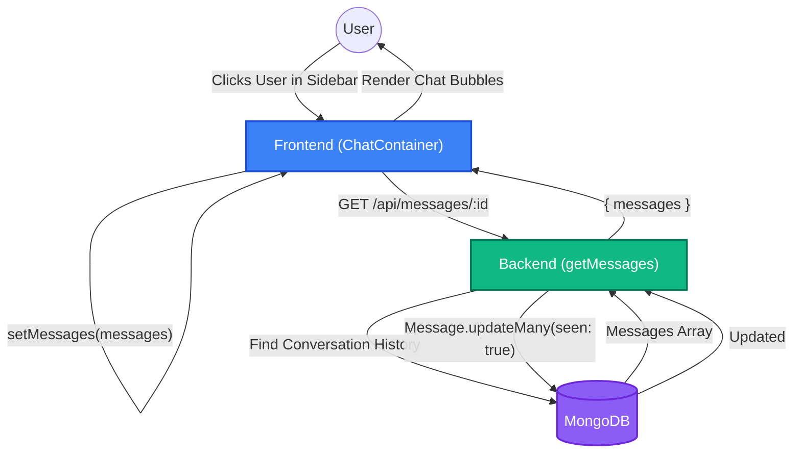

# 🌟 Deep Dive: Major Functions Explained

Just like we broke down the typing indicator, this document provides a detailed tutorial and step-by-step breakdown of how every major function in your ChatApp works under the hood.

---

## 🚀 1. The Authentication & Session Flow (`checkAuth`)
**Goal:** How does the app remember who you are when you refresh the page?

### 📌 The Flow:
1. **The Initial Load (Frontend)**: 
   - When you open the React app, `AuthContext.jsx` mounts.
   - It checks `localStorage` for a JWT token: `const [token, setToken] = useState(localStorage.getItem("token"));`
   - If a token exists, the `useEffect` hook triggers the `checkAuth()` function.
   - It attaches the token to the global Axios headers: `api.defaults.headers.common["token"] = token;`

2. **The Request (Frontend -> Backend)**:
   - `axios.get("/api/auth/check")` is sent.

3. **The Middleware Gatekeeper (Backend)**:
   - Before hitting the controller, the request goes through `protectRoute` (in `middleware/auth.js`).
   - `protectRoute` reads the token, verifies it using `jwt.verify`, extracts the `userId`, and fetches the user from MongoDB (without the password).
   - It attaches this user to the request object: `req.user = user;`

4. **The Controller (Backend)**:
   - The `checkAuth` controller in `userController.js` simply takes that `req.user` and sends it back to the frontend: `res.json({ success: true, user: req.user });`

5. **The State Update (Frontend)**:
   - Back in `AuthContext`, `setAuthUser(data.user)` is called.
   - Now the entire React app knows who is logged in. 
   - **Crucial Step**: It immediately calls `connectSocket(data.user)`, linking this specific user to the real-time Socket.IO server.

### 📌 The Diagram:

---

## 🚀 2. The Sidebar Users & Unread Badge Flow (`getUsersForSidebar`)
**Goal:** How does the sidebar know who to show, and how many unread messages you have from each person?

### 📌 The Flow:
1. **The Request (Frontend)**:
   - `ChatContext.jsx` runs `getUsers()`, hitting `GET /api/messages/users`.

2. **Fetching Users (Backend)**:
   - `getUsersForSidebar` in `messageController.js` gets your `userId` from the protected route.
   - It queries MongoDB: `User.find({ _id: { $ne: userId } })`. The `$ne` means "Not Equal". It finds everyone in the database *except* you.

3. **Calculating Unseen Messages (Backend)**:
   - It creates an empty object: `const unseenMessages = {};`
   - It loops through *every single user* it just found.
   - For each user, it runs a MongoDB query: "Find all messages where `senderId` is them, `receiverId` is me, and `seen` is false."
   - If `messages.length > 0`, it adds that count to the `unseenMessages` object.
   - *Advanced Note:* It uses `Promise.all(promises)` so it can do all these database searches concurrently, making it much faster!

4. **The UI Update (Frontend)**:
   - The backend sends back the `users` array and the `unseenMessages` object.
   - Frontend stores them in state: `setUsers` and `setunseenMessages`.
   - Your Sidebar maps over `users` and uses the `unseenMessages` object to display the little notification badges.

### 📌 The Diagram:

---

## 🚀 3. The Messaging & Real-Time Sync Flow (`sendMessage` & `newMessage` event)
**Goal:** How does a message get sent, saved, and instantly appear on the other person's screen?

### 📌 The Flow:
1. **The Send (Frontend)**:
   - You type a message and hit enter. `ChatContext.jsx` runs `sendMessage()`.
   - It POSTs `{text, image}` to `/api/messages/send/:selectedUserId`.

2. **Database & Cloudinary (Backend)**:
   - The `sendMessage` controller gets the `receiverId` from the URL, and `senderId` from `req.user`.
   - If there is an image, it uploads it to **Cloudinary** first, waiting for the secure URL to come back.
   - It saves the message to MongoDB using `Message.create()`.

3. **The Real-Time Jump (Backend Socket.IO)**:
   - Before returning a response to the sender, the server looks up the receiver's live connection.
   - `const receiverSocketId = userSocketMap[receiverId];`
   - If they are online, it shoots the message directly to them over WebSockets: `io.to(receiverSocketId).emit("newMessage", newMessage);`

4. **The Sender UI Update (Frontend)**:
   - The backend responds with `success: true`.
   - The sender's `ChatContext` simply takes the new message and adds it to the bottom of their chat window: `setMessages((prev) => [...prev, data.newMessage])`.

5. **The Receiver UI Update (Frontend)**:
   - Meanwhile, on the receiver's computer, `ChatContext.jsx` has a `useEffect` listening for `"newMessage"`.
   - When `"newMessage"` triggers, it runs a very smart **Logic Check**:
     - **Condition A (You are currently chatting with the sender)**: 
       - It adds the message to the screen instantly.
       - Because you are actively looking at the chat, it manually flips `newMessage.seen = true` on the frontend.
       - It fires a silent background API call: `axios.get('/api/messages/mark/:id')` to tell the backend database to mark it as read.
     - **Condition B (You are looking at someone else's chat, or are on another page)**:
       - It does *not* add the message to the chat window (because you aren't looking at it).
       - Instead, it updates the `unseenMessages` state, adding +1 to that specific user's notification badge in your sidebar!

### 📌 The Diagram:

---

## 🚀 4. The Conversation Load & Read Receipt Flow (`getMessages`)
**Goal:** What happens when you click on a user in the sidebar?

### 📌 The Flow:
1. **The Click (Frontend)**:
   - You click a user. `setSelectedUser` changes.
   - A `useEffect` in `ChatContainer.jsx` detects this change and calls `getMessages(selectedUser._id)`.

2. **Fetching Chat History (Backend)**:
   - `messageController.js` -> `getMessages` runs.
   - It searches MongoDB for any message where (I sent it to Them) OR (They sent it to Me).
   - This pulls the entire conversation history.

3. **The Auto-Read Mechanism (Backend)**:
   - Because you just opened the chat, it assumes you have read everything they sent.
   - It instantly runs an `updateMany` query on MongoDB:
     - `Message.updateMany({ senderId: selectedUserId, receiverId: myId }, { seen: true })`
   - This changes all their unread messages to read in the database permanently.

4. **The Render (Frontend)**:
   - The backend sends the messages array back to the frontend.
   - `setMessages` updates the state, and `ChatContainer.jsx` renders the beautiful chat bubbles on your screen!

### 📌 The Diagram:

