# 🌟 12. Endpoints & Functions Tree (The Backend Brain)

Ye document ekdam "Cheat Sheet" hai tere Express backend ke liye. Isme har API Endpoint, usko handle karne wala Controller function, wo kya inputs leta hai, aur internally kya karta hai — sab detailed hai. Isko master kar liya toh backend ka poora control tere haath mein hoga.

---

## 🌳 The Routing Tree (Bird's Eye View)

```mermaid
flowchart LR
    APP["express() App"] --> API["/api"]

    %% User Routes
    API --> AUTH["/auth (userRoutes)"]
    AUTH --> SIGNUP["POST /signup<br/>👉 signup()"]
    AUTH --> LOGIN["POST /login<br/>👉 login()"]
    AUTH --> LOGOUT["GET /check<br/>👉 checkAuth()<br/>🔒 Protected"]
    AUTH --> UPDATE["PUT /update-profile<br/>👉 updateProfile()<br/>🔒 Protected"]

    %% Message Routes
    API --> MSG["/messages (messageRoutes)"]
    MSG --> USERS["GET /users<br/>👉 getUsersForSidebar()<br/>🔒 Protected"]
    MSG --> GETMSG["GET /:id<br/>👉 getMessages()<br/>🔒 Protected"]
    MSG --> MARK["GET /mark/:id<br/>👉 markMessagesAsSeen()<br/>🔒 Protected"]
    MSG --> SEND["POST /send/:id<br/>👉 sendMessage()<br/>🔒 Protected"]

    style APP fill:#0f172a,stroke:#38bdf8,color:#fff
    style AUTH fill:#1e293b,stroke:#22c55e,color:#fff
    style MSG fill:#1e293b,stroke:#eab308,color:#fff
    style SIGNUP fill:#064e3b,stroke:#10b981
    style LOGIN fill:#064e3b,stroke:#10b981
    style UPDATE fill:#451a03,stroke:#f59e0b
    style SEND fill:#064e3b,stroke:#10b981
```

---

## 👤 1. User Controllers (`userController.js`)

Ye file User ke identity, account creation, login, aur profile pic related saare operations handle karti hai. Iska data seedha MongoDB ke `users` collection me jata hai.

### 📌 `signup(req, res)`
- 💡 **Route:** `POST /api/auth/signup`
- 💡 **What it does:** Naya user account banata hai.
- 💡 **Inputs (req.body):** `{ fullName, email, password, bio }`
- 💡 **Dependencies used:** `bcryptjs` (hash password), `jsonwebtoken` (token generate), `User` model.
- 💡 **Flow:**
  1. Check agar email pehle se exist karta hai.
  2. Password ko `bcrypt.hash()` se encrypt karta hai (kyunki DB me plain text me password rakhna paap hai).
  3. MongoDB me naya User save karta hai.
  4. Naya JWT token banata hai.
  5. JSON response deta hai `{ success: true, user: {...}, token: "..." }`.

### 📌 `login(req, res)`
- 💡 **Route:** `POST /api/auth/login`
- 💡 **What it does:** Puraane user ko app me ghusne deta hai.
- 💡 **Inputs (req.body):** `{ email, password }`
- 💡 **Dependencies used:** `bcryptjs.compare`, `jsonwebtoken`, `User` model.
- 💡 **Flow:**
  1. DB me dekhta hai kya is email ka banda hai? Agar nahi, throw error.
  2. `bcrypt.compare()` se check karta hai ki kya diya gaya password DB ke encrypted password se match khata hai.
  3. Agar match, naya JWT token bana kar bhej deta hai.

### 📌 `checkAuth(req, res)`
- 💡 **Route:** `GET /api/auth/check` (Protected via `protectRoute`)
- 💡 **What it does:** Frontend ko batata hai ki "Haan, tera purana token abhi bhi valid hai, tu logged in hai." Jab user page refresh karta hai tab ye hit hota hai.
- 💡 **Inputs:** `req.user` (Ye middleware `protectRoute` set karke bhejta hai).
- 💡 **Flow:** Sirf `req.user` ka data JSON me wapas bhej deta hai.

### 📌 `updateProfile(req, res)`
- 💡 **Route:** `PUT /api/auth/update-profile` (Protected)
- 💡 **What it does:** User ki display picture (DP) aur basic info update karta hai.
- 💡 **Inputs (req.body):** `{ profilePic, bio, fullName }`
- 💡 **Dependencies used:** `cloudinary.uploader.upload` (image upload ke liye), `User.findByIdAndUpdate()`.
- 💡 **Flow:**
  1. Agar base64 `profilePic` aaya hai, toh use **Cloudinary** par upload karta hai aur wahan se image ka `secure_url` (CDN link) nikalta hai.
  2. Us `secure_url`, naye bio aur fullName ko MongoDB me user ki ID ke corresponding update kar deta hai.

---

## 💬 2. Message Controllers (`messageController.js`)

Ye file chatting system ka dil (heart) hai. Messages bhejte waqt HTTP request aur Socket.IO dono idhar se mil kar chalte hain.

### 📌 `getUsersForSidebar(req, res)`
- 💡 **Route:** `GET /api/messages/users` (Protected)
- 💡 **What it does:** Sidebar me dikhane ke liye aapke alawa baaki saare users ki list laata hai.
- 💡 **Inputs:** `req.user._id` (Khudki ID, taaki khudko chat list me na dikhaye).
- 💡 **Flow:** `User.find({ _id: { $ne: req.user._id } }).select('-password')`. Yani DB se password hata kar baaki saare users ki info le aao jo "meri ID ke barabar nahi hain" (`$ne` = not equal).

### 📌 `getMessages(req, res)`
- 💡 **Route:** `GET /api/messages/:id` (Protected)
- 💡 **What it does:** Aapke (Aman) aur kisi specific bande (Rahul) ke beech ki poori chat history laata hai.
- 💡 **Inputs (req.params):** `:id` (Rahul ki ID jisse aap chat kar rahe ho). `req.user._id` (Aapki ID).
- 💡 **Flow:** 
  DB me query marta hai ki wo saare messages lao jahan:
  (Sender me hu AUR receiver Rahul hai) YAA (Sender Rahul hai AUR receiver main hu).
  Aur unko time ke hisaab se sort kar do.

### 📌 `sendMessage(req, res)`
- 💡 **Route:** `POST /api/messages/send/:id` (Protected)
- 💡 **What it does:** Ek naya message bhejta hai. Sabse zaroori controller yahi hai!
- 💡 **Inputs:** 
  - `req.params.id` (Kisko bhej rahe ho - Receiver)
  - `req.body` `{ text, image }` (Kya bhej rahe ho)
- 💡 **Dependencies used:** `Message` model, `Cloudinary`, `Socket.IO (io)`, `userSocketMap`.
- 💡 **Flow:**
  1. Agar image hai, Cloudinary pe dal kar URL nikalta hai.
  2. MongoDB me `Message.create()` karke naya message document banata hai.
  3. **The Real-Time Magic:** Check karta hai `userSocketMap[receiverId]` (Kahan hai receiver ka socket?). Agar wo currently app use kar raha hai (socketId exists), toh usko `io.to(socketId).emit("newMessage", msg)` karke turant live message push kar deta hai!
  4. Response me sender ko success aur message JSON de deta hai.

### 📌 `markMessagesAsSeen(req, res)`
- 💡 **Route:** `GET /api/messages/mark/:id` (Protected)
- 💡 **What it does:** WhatsApp ka "Blue Tick" system.
- 💡 **Inputs (req.params):** `:id` (Message ki ID ya sender ki ID jiske msgs read kiye).
- 💡 **Flow:** MongoDB me un sabhi messages ko dhoondhta hai jinke "seen" abhi false hai, aur usko update karke true kar deta hai.

---

Bhai agar tune ye 8 endpoints aur `protectRoute` middleware dimag me baitha liya, toh is project ka backend tujhe sapne me bhi yaad rahega! Ekdum crystal clear backend architecture!
