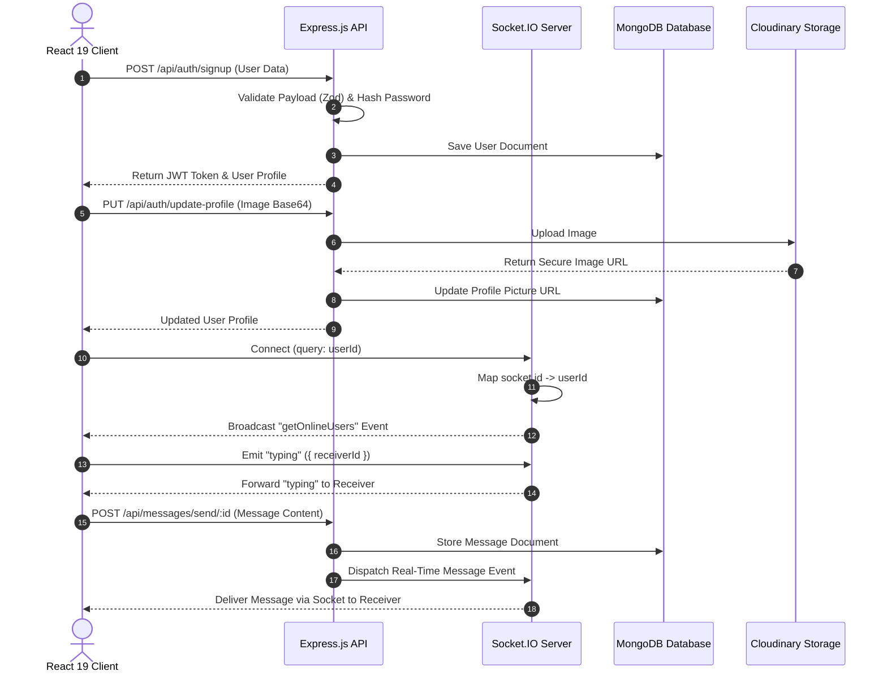

<div align="center">

  # 💬 ChatApp — Real-Time Full-Stack Messaging Platform

  <p align="center">
    <b>A modern, high-performance, full-stack real-time messaging application with instant status updates, typing indicators, secure authentication, and cloud media attachments.</b>
  </p>

  <p align="center">
    <a href="#-features">Key Features</a> •
    <a href="#-tech-stack">Tech Stack</a> •
    <a href="#-architecture">Architecture</a> •
    <a href="#-getting-started">Getting Started</a> •
    <a href="#-api-documentation">API Specs</a> •
    <a href="#-socket-events">Socket Events</a>
  </p>

  <!-- Badges -->
  <p align="center">
    
    
    
    
    
    
    
    
  </p>

</div>

---

## 📸 Overview & UI Preview

ChatApp provides a seamless communication experience built on a responsive dark UI. Users can register accounts, update profile avatars, send real-time text and media messages, and observe online presence alongside typing status updates in real-time.

```
+-----------------------------------------------------------------------------------+
|  ChatApp UI Layout                                                                |
+------------------------------------+----------------------------------------------+
| [Users & Online Status Sidebar]    | [Active Chat Room Header]                   |
| 🟢 Alice (Online - Typing...)     | 💬 Alice (Online)                            |
| ⚪ Bob (Offline)                   |                                              |
|                                    | 📥 Alice: Hey! Is the Socket.io ready?       |
|                                    | 📤 You: Yes! Connected with low latency ⚡   |
|                                    |                                              |
|                                    | [ 📎 Attach Image ] [ Type message... ] [🚀] |
+------------------------------------+----------------------------------------------+
```

---

## ✨ Features

- ⚡ **Real-Time Messaging**: Built on **Socket.IO** for instant, bi-directional message delivery with zero page refreshes.
- 🟢 **Online Presence Tracking**: Live user status updates dynamically reflecting connected and disconnected users.
- ✍️ **Typing Indicators**: Real-time notification when the peer in conversation is actively composing a message.
- 🔐 **Secure Authentication**: User sign-up and login with password hashing via **bcryptjs** and session security using **JWT**.
- 🛡️ **Strict Schema Validation**: End-to-end payload validation powered by **Zod** across authentication and messaging endpoints.
- 🖼️ **Media Attachments**: Profile pictures and media uploads handled seamlessly with **Cloudinary** cloud storage.
- 🎨 **Modern Dark-Mode UI**: Built with **React 19**, **Vite**, and **Tailwind CSS v4** featuring toast notifications via `react-hot-toast`.

---

## 🛠️ Tech Stack

| Layer | Technology | Purpose |
| :--- | :--- | :--- |
| **Frontend UI** | **React 19 + Vite** | High performance component-driven single page application |
| **Styling** | **Tailwind CSS v4** | Modern utility-first styling and theme design |
| **State & Router** | **React Router DOM v7** | Single-page client routing and screen management |
| **Notifications** | **React Hot Toast** | Interactive UX feedback and alert toasts |
| **Backend API** | **Node.js + Express 5** | RESTful backend microservices architecture |
| **Real-Time Engine** | **Socket.IO** | Bi-directional event-driven websocket protocol |
| **Database** | **MongoDB + Mongoose** | NoSQL Document database for persistence |
| **Validation** | **Zod** | Type-safe runtime schema validation |
| **Media Cloud** | **Cloudinary** | Image processing and cloud CDN storage |
| **Security** | **JWT + Bcrypt.js** | Stateless authentication and token verification |

---

## 📐 Architecture



---

## 📁 Repository Structure

```
chatapp/
├── client/                     # React 19 + Vite Frontend Application
│   ├── src/
│   │   ├── components/         # Chat Sidebar, Message View, Navbar & Modals
│   │   ├── context/            # AuthContext, ChatContext, SocketContext
│   │   ├── pages/              # Home, Login, Signup, Profile pages
│   │   ├── lib/                # Axios instance & socket setup
│   │   └── App.jsx             # Main router root
│   ├── package.json
│   └── vite.config.js
│
├── server/                     # Node.js + Express + Socket.IO Server
│   ├── controllers/            # Auth & Message request handlers
│   ├── lib/                    # DB connection, Cloudinary & Token helpers
│   ├── middleware/             # Auth middleware & Zod validation
│   ├── models/                 # Mongoose User & Message schemas
│   ├── routes/                 # Express API router definitions
│   ├── server.js               # Express app & Socket.IO server initialization
│   └── package.json
│
└── docs/                       # Architecture notes & API documentation
```

---

## 🚀 Getting Started

### Prerequisites

Make sure you have the following installed on your development machine:
- **Node.js** `>= 18.0.0`
- **npm** `>= 9.0.0`
- **MongoDB** instance (Local or MongoDB Atlas)
- **Cloudinary** account credentials

---

### Installation & Environment Setup

#### 1. Clone the repository
```bash
git clone https://github.com/HxWildE/ChatApp.git
cd ChatApp
```

#### 2. Configure Backend (`/server`)

Navigate to `server` and install dependencies:
```bash
cd server
npm install
```

Create a `.env` file inside the `server/` directory:
```env
PORT=5000
MONGO_URI=mongodb+srv://<username>:<password>@cluster.mongodb.net/chatapp?retryWrites=true&w=majority
JWT_SECRET=your_super_secret_jwt_key_here
CLOUDINARY_CLOUD_NAME=your_cloudinary_cloud_name
CLOUDINARY_API_KEY=your_cloudinary_api_key
CLOUDINARY_API_SECRET=your_cloudinary_api_secret
```

#### 3. Configure Frontend (`/client`)

Navigate to `client` and install dependencies:
```bash
cd ../client
npm install
```

---

### Running the Application

#### Start the Server (Backend)
```bash
cd server
npm run server
```
> Server runs on `http://localhost:5000`

#### Start the Client (Frontend)
```bash
cd client
npm run dev
```
> App will be accessible at `http://localhost:5173`

---

## 📡 API Documentation

### Auth Endpoints (`/api/auth`)

| Method | Endpoint | Description | Auth Required |
| :--- | :--- | :--- | :---: |
| `POST` | `/api/auth/signup` | Register a new user account (Zod validated) | ❌ |
| `POST` | `/api/auth/login` | Authenticate user and issue JWT | ❌ |
| `POST` | `/api/auth/logout` | Clear user session | 🟢 |
| `PUT` | `/api/auth/update-profile` | Upload profile image to Cloudinary | 🟢 |
| `GET` | `/api/auth/check` | Verify existing authentication state | 🟢 |

### Message Endpoints (`/api/messages`)

| Method | Endpoint | Description | Auth Required |
| :--- | :--- | :--- | :---: |
| `GET` | `/api/messages/users` | Fetch sidebar users for conversation list | 🟢 |
| `GET` | `/api/messages/:id` | Fetch conversation history with user `:id` | 🟢 |
| `POST` | `/api/messages/send/:id` | Send text/image message to user `:id` | 🟢 |

---

## ⚡ Socket.IO Events Reference

| Event Name | Direction | Payload | Description |
| :--- | :--- | :--- | :--- |
| `connection` | Client ➔ Server | `query: { userId }` | Registers user socket connection |
| `getOnlineUsers` | Server ➔ Client | `Array<string>` | Emits array of currently active user IDs |
| `typing` | Client ➔ Server ➔ Peer | `{ receiverId }` | Triggers active typing indicator on recipient's UI |
| `stopTyping` | Client ➔ Server ➔ Peer | `{ receiverId }` | Clears active typing indicator on recipient's UI |
| `newMessage` | Server ➔ Client | `MessageObject` | Real-time push of newly received message |
| `disconnect` | Client ➔ Server | - | Cleans up socket mapping & updates online users |

---

## 🤝 Contributing

Contributions, issues, and feature requests are welcome!  
Feel free to check out the [issues page](https://github.com/HxWildE/ChatApp/issues).

1. Fork the Project
2. Create your Feature Branch (`git checkout -b feature/AmazingFeature`)
3. Commit your Changes (`git commit -m 'feat: add AmazingFeature'`)
4. Push to the Branch (`git push origin feature/AmazingFeature`)
5. Open a Pull Request

---

## 📝 License

Distributed under the ISC License. See `LICENSE` for more information.

<div align="center">
  <p>Crafted with ❤️ by <a href="https://github.com/HxWildE">HxWildE</a></p>
</div>
