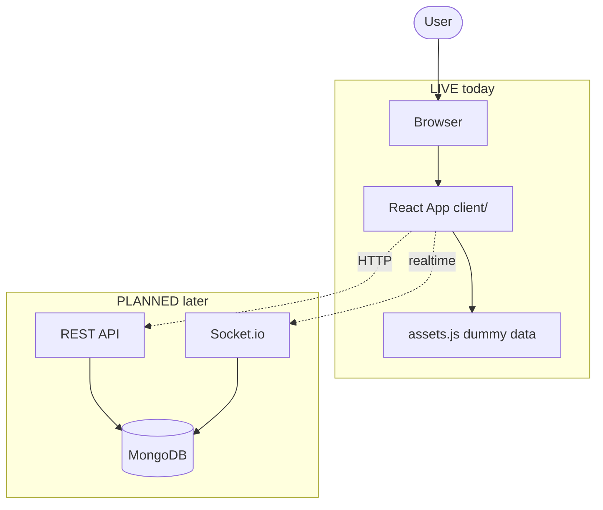
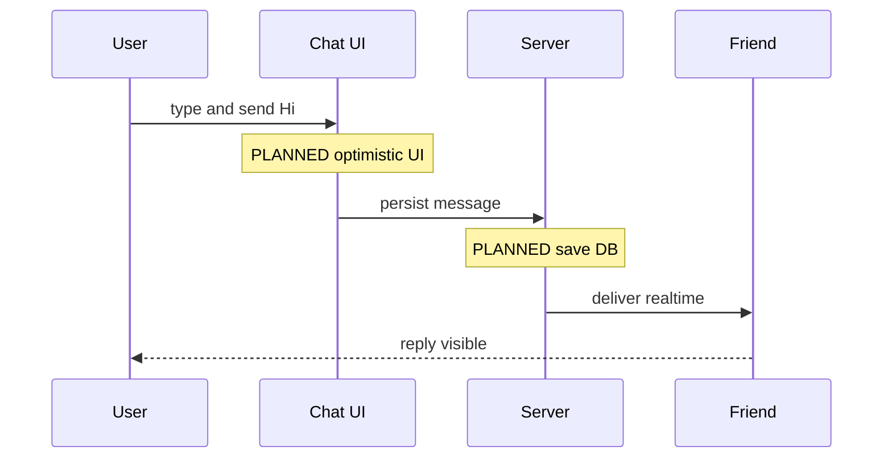
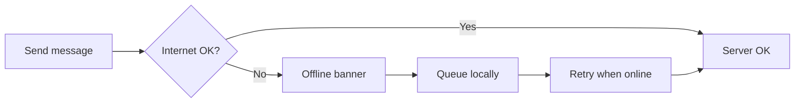

# DEMO — Architecture agent diagrams aise dikhenge

> **Diagram render nahi ho rahe?** → Neeche **Fix** padho, ya kholo: [`preview.html`](./preview.html) (browser mein 100% chalega)

---

## Fix — MD preview mein Mermaid

Cursor/VS Code **default preview Mermaid support nahi karta**.

### Option A (best for .md files)

1. Extensions (`Ctrl+Shift+X`)
2. Search: **Markdown Preview Mermaid Support** (author: **Matt Bierner**)
3. Install → DEMO file → **Ctrl+Shift+V** dubara

### Option B (bina extension)

1. Open `docs/architecture/preview.html`
2. Right-click → **Reveal in File Explorer** → double-click → Chrome/Edge
3. Teen diagrams turant dikhenge

GitHub par repo push karoge → `.md` files wahan Mermaid **automatic** render hota hai.

---

## 1. Simple system (dummy)

**Hinglish:** User browser se app kholta hai → abhi sirf React → baad mein API + DB.



**Dotted arrows** = abhi connect nahi, future design.

---

## 2. Ek message bhejna (dummy sequence)



---

## 3. Fallback (error) — dummy



---

## Agent update ke baad

| Abhi | `update architecture` ke baad |
|------|-------------------------------|
| Generic | Real paths: HomePage.jsx, assets.js |
| PLANNED tags | LIVE / PARTIAL / PLANNED from code |
| — | Changelog date on top |

---

## Command

```
Use architecture-visualizer — update architecture
```
