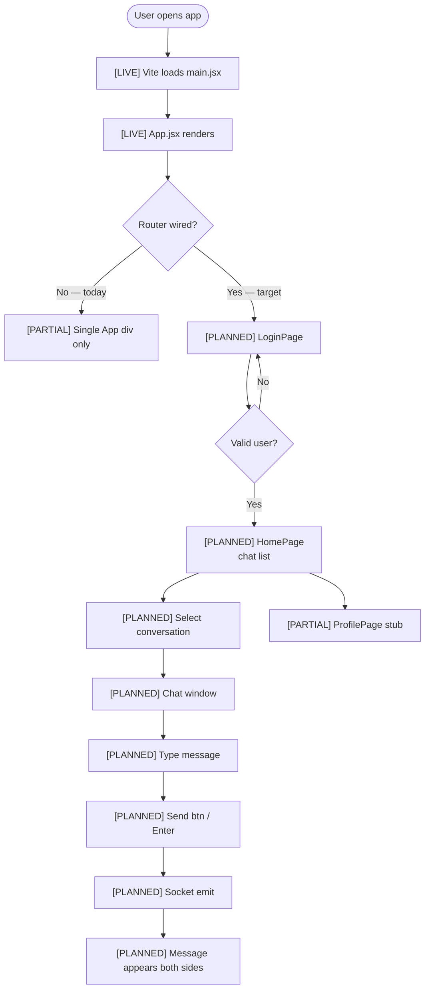
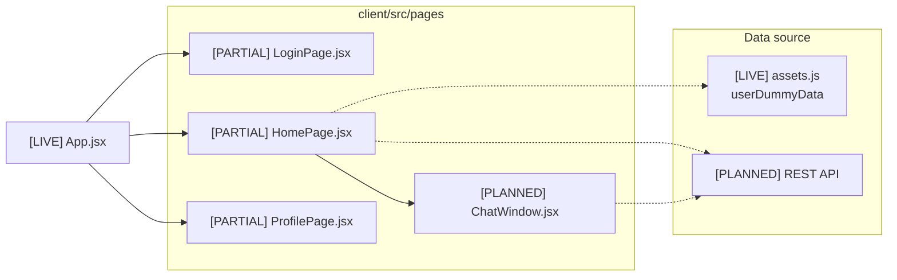
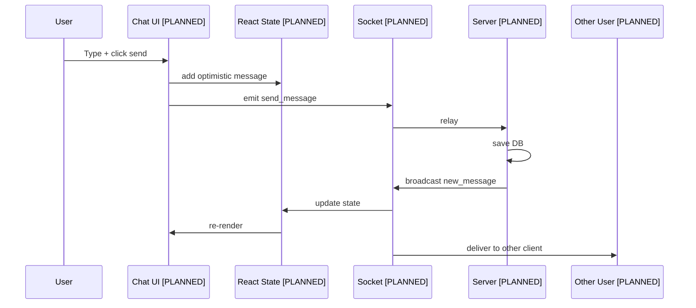
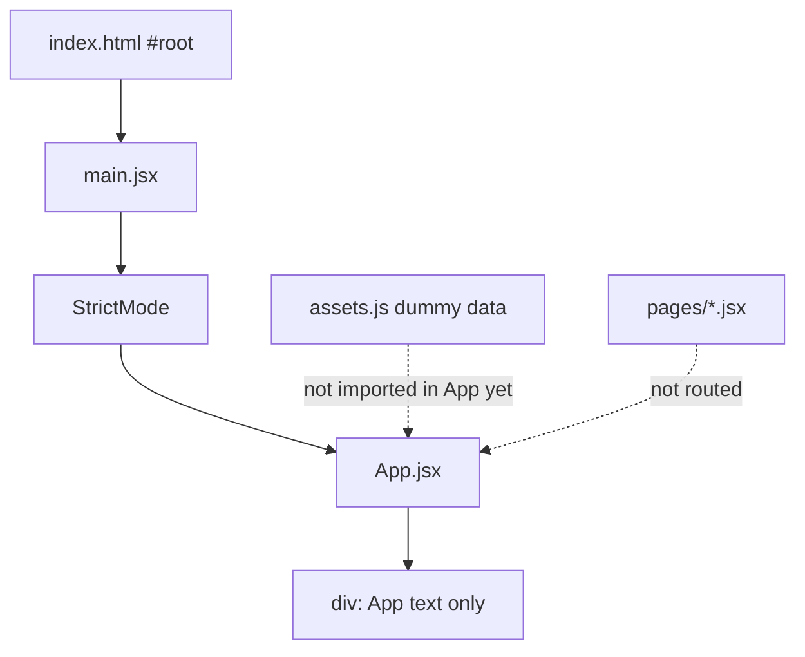
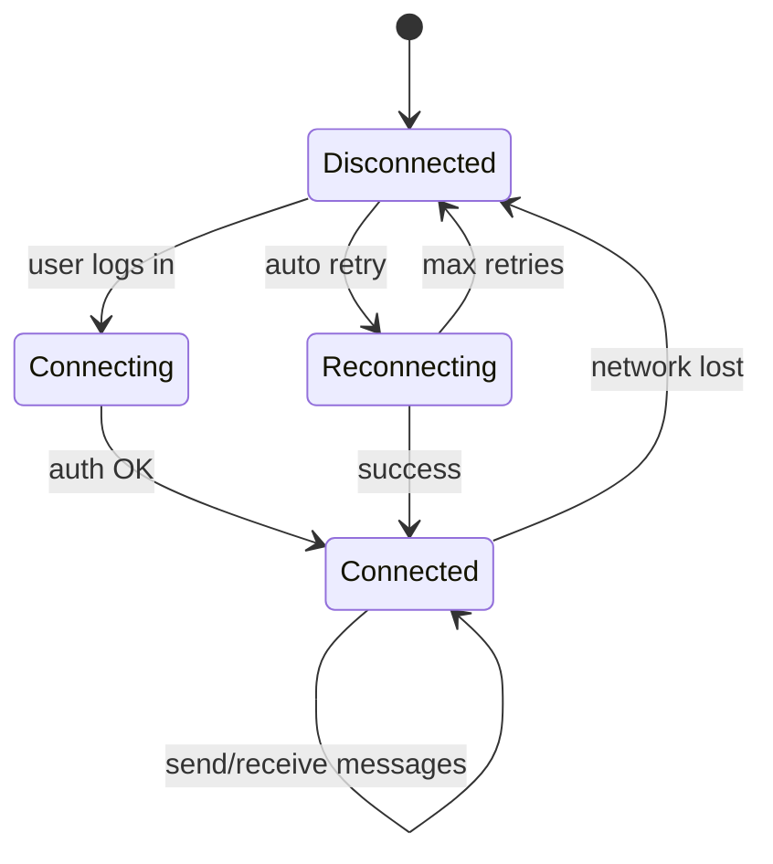
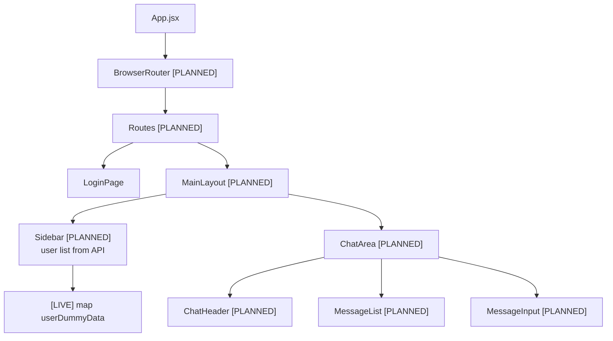

# ChatApp — How It Works (Visual)

> End-to-end chat app flow for **understanding + interviews**.  
> **Update:** `Use architecture-visualizer — update chat flow`

*Last synced: 2026-05-15*

---

## Changelog

### 2026-05-15
- Initial user journey, component tree, message lifecycle (live vs planned).

---

## Legend

| Tag | Meaning |
|-----|---------|
| 🟢 `[LIVE]` | Exists now |
| 🟡 `[PARTIAL]` | File exists, logic incomplete |
| ⚪ `[PLANNED]` | Not built yet |

---

## 1. Poora app — user journey

<!-- STATUS: partial -->

**Hinglish:** Aaj app start hoti hai `main.jsx` se, lekin router nahi — isliye pages dikhte hi nahi. Neeche wala flow **target** hai jab sab wire ho jayega.

---

## 2. Screens map (files)

<!-- STATUS: partial -->

---

## 3. Ek message bhejne ka lifecycle

<!-- STATUS: planned -->

**Hinglish:** Pehle message turant screen par (optimistic), phir server confirm kare — fast UX ke liye.

---

## 4. Abhi LIVE kya hota hai (today)

<!-- STATUS: implemented -->

**Hinglish:** Dummy data aur pages **ban chuke** hain par `App.jsx` unhe use nahi karta — agla step router + layout.

---

## 5. Socket connection states (target)

<!-- STATUS: planned -->

---

## 6. Component tree (target layout)

<!-- STATUS: planned -->

---

## 7. Data on screen — dummy vs real

| UI need | Today | Later |
|---------|--------|--------|
| User list | `userDummyData` in assets.js | `GET /api/users` |
| Avatars | imported PNGs | same URLs from API |
| Messages | hardcoded / mock | WebSocket + DB |
| Login | stub page | JWT + API |

---

## Optional GIFs

See [`gifs/README.md`](./gifs/README.md) — screen recordings you can add for demos.

---

*Run `update chat flow` when pages, router, or chat UI change.*
