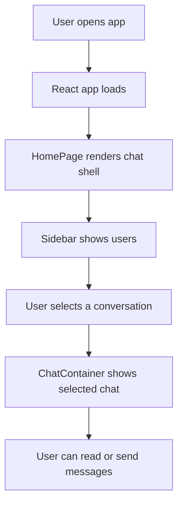
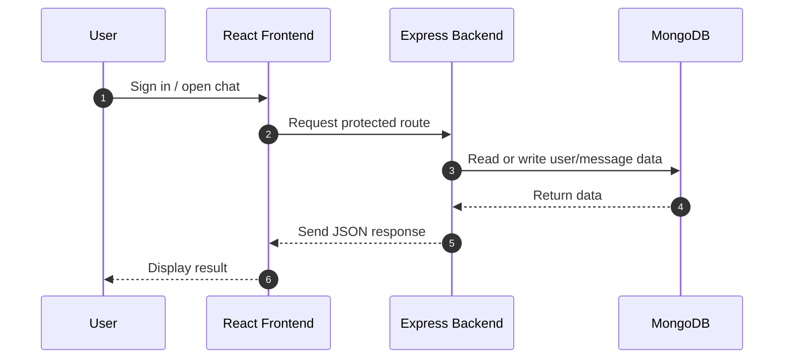

# ChatApp — How It Works

This note explains the current application flow and the main files involved.

## User journey

```mermaid
flowchart TD
    A[User opens app] --> B[React app loads]
    B --> C[HomePage renders chat shell]
    C --> D[Sidebar shows users]
    D --> E[User selects a conversation]
    E --> F[ChatContainer shows selected chat]
    F --> G[User can read or send messages]
```

## Main files

| Area | File | Purpose |
|------|------|---------|
| App shell | client/src/App.jsx | Declares routes for home, login, and profile |
| Home view | client/src/pages/HomePage.jsx | Hosts the main chat layout |
| Sidebar | client/src/components/Sidebar.jsx | Displays available users |
| Chat UI | client/src/components/ChatContainer.jsx | Renders the active conversation |
| API entry | server/server.js | Starts Express and attaches routes |
| Auth API | server/controllers/userController.js | Handles signup, login, and profile updates |
| Message API | server/controllers/messageController.js | Fetches and marks messages |
| Models | server/models/User.js and server/models/Message.js | Defines MongoDB data structures |

## Current behavior

- The home page displays a chat-style layout.
- Selecting a user changes the visible chat container.
- The backend exposes authentication and messaging endpoints.
- The app is ready for real-time chat integration, but the UI still depends on the existing frontend shell and backend data flow.

## Backend flow

```mermaid
sequenceDiagram
    autonumber
    participant U as User
    participant FE as React Frontend
    participant BE as Express Backend
    participant DB as MongoDB

    U->>FE: Sign in / open chat
    FE->>BE: Request protected route
    BE->>DB: Read or write user/message data
    DB-->>BE: Return data
    BE-->>FE: Send JSON response
    FE-->>U: Display result
```

## What is still pending

- Real-time message delivery via Socket.IO is not fully wired to the UI yet.
- The current chat messages are still based on the existing frontend shell and sample data structure.
- Full end-to-end chat send/receive will require connecting the form input to the backend API and socket events.

