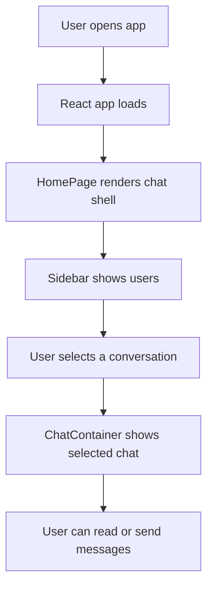
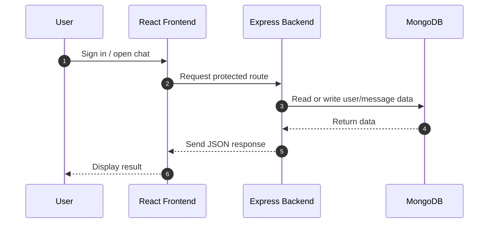

# 🧭 ChatApp — How It Works

> 📊 **Diagram visualizer:** Diagrams not rendering in VS Code preview? Open [`preview.html`](./preview.html) in your browser, or install the VS Code extension **Markdown Preview Mermaid Support** (by Matt Bierner).

This note explains the current application flow, user journey, and the main files involved in delivering the real-time chat experience.

---

## 🛤️ User Journey

```mermaid
flowchart TD
    A[User opens app] --> B[React app loads]
    B --> C[HomePage renders chat shell]
    C --> D[Sidebar shows users]
    D --> E[User selects a conversation]
    E --> F[ChatContainer shows selected chat]
    F --> G[User can read or send messages]
```

---

## 📂 Main Files Reference

| Area | File | Purpose |
|------|------|---------|
| **App Shell** | `client/src/App.jsx` | Declares routes for home, login, and profile |
| **Home View** | `client/src/pages/HomePage.jsx` | Hosts the main chat layout |
| **Sidebar** | `client/src/components/Sidebar.jsx` | Displays available users |
| **Chat UI** | `client/src/components/ChatContainer.jsx` | Renders the active conversation |
| **API Entry** | `server/server.js` | Starts Express and attaches routes |
| **Auth API** | `server/controllers/userController.js` | Handles signup, login, and profile updates |
| **Message API** | `server/controllers/messageController.js` | Fetches and marks messages |
| **Models** | `server/models/User.js` & `Message.js` | Defines MongoDB data structures |

---

## 🚦 Current Behavior

- The home page displays a responsive chat-style layout.
- Selecting a user from the sidebar dynamically changes the visible chat container.
- The backend exposes authentication and messaging endpoints for real-time operations.
- The app is ready for real-time chat integration. The UI is currently wired to backend endpoints, fetching data from MongoDB.

---

## ⚙️ Backend Flow

```mermaid
sequenceDiagram
    autonumber
    participant U as User
    participant FE as React Frontend
    participant BE as Express Backend
    participant DB as MongoDB

    U->>FE: Sign in / open chat
    FE->>BE: Request protected route
    BE->>DB: Read or write user/message data
    DB-->>BE: Return data
    BE-->>FE: Send JSON response
    FE-->>U: Display result
```

---

## 🚧 What Is Still Pending

- Real-time message delivery via Socket.IO is partially wired but requires full end-to-end testing.
- Full end-to-end chat send/receive requires refining the form input connection to the backend API and socket events.
- Advanced socket events (like typing indicators) are to be refined.
