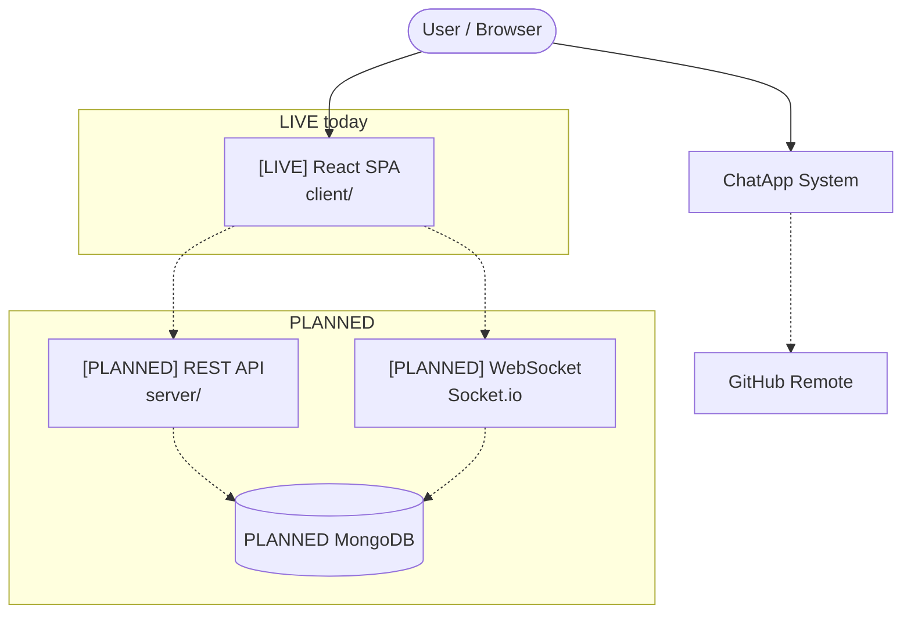
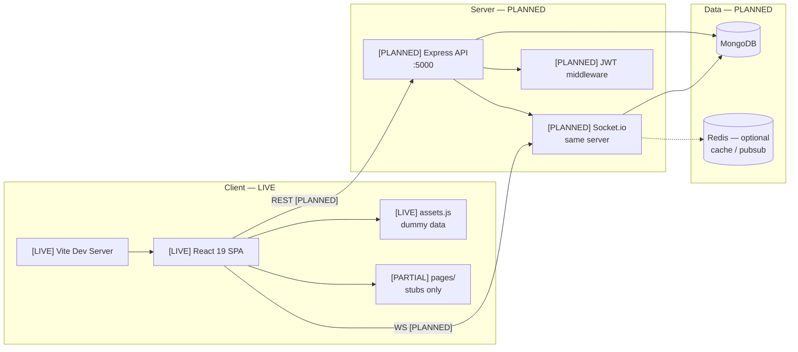
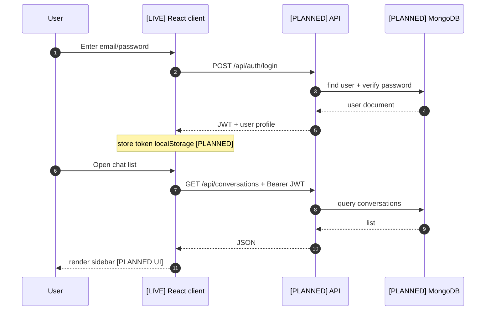
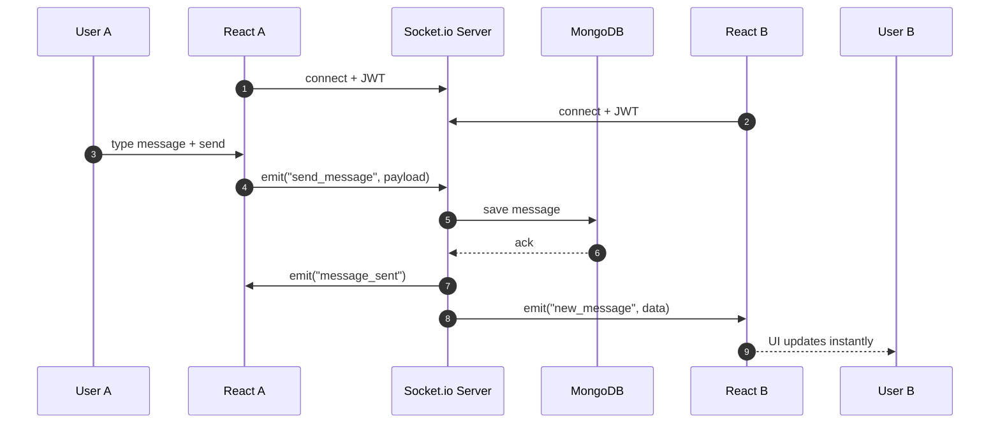
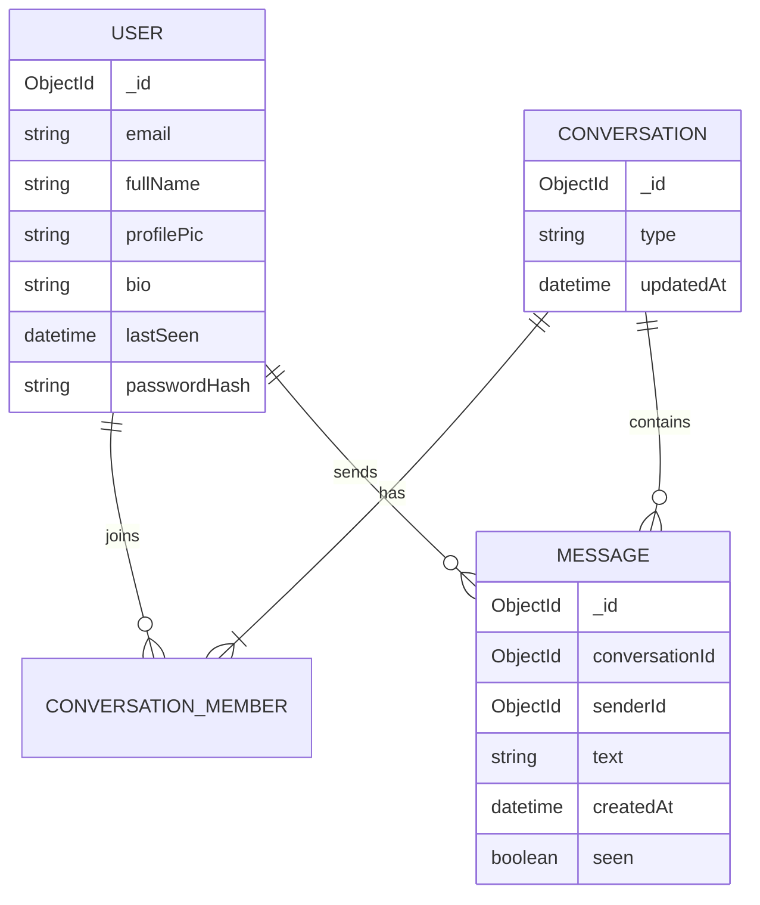
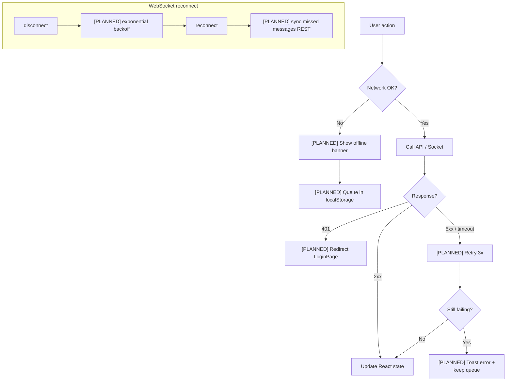
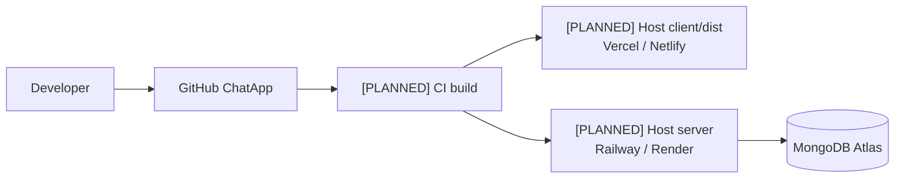

# ChatApp — System Design (Architecture)

> Visual architecture: API, DB, WebSocket, fallbacks, storage.  
> **Update:** `Use architecture-visualizer — update architecture`

*Last synced: 2026-05-15*

---

## Changelog

### 2026-05-15
- Initial diagrams: current frontend-only vs target full-stack design.

---

## Legend

| Tag | Meaning |
|-----|---------|
| 🟢 `[LIVE]` | Code exists in repo now |
| 🟡 `[PARTIAL]` | Started, not finished |
| ⚪ `[PLANNED]` | Target design — not built yet |

---

## 1. Context (C4 — Level 1)

<!-- STATUS: partial -->

**Hinglish:** Abhi user sirf browser se React app dekhta hai. Backend/DB baad mein add honge — diagram mein dotted = planned.

---

## 2. Containers (Level 2)

<!-- STATUS: partial -->

---

## 3. REST call flow (login + fetch chats)

<!-- STATUS: planned -->

**Hinglish:** Login pehle API se token lega, phir har request ke saath JWT bhejega — abhi ye flow code mein nahi, design ready hai.

---

## 4. Real-time message flow (WebSocket)

<!-- STATUS: planned -->

---

## 5. Database schema (target)

<!-- STATUS: planned -->

**Note:** `assets.js` mein `userDummyData` isi shape ka **fake** data hai — API aane par replace hoga.

---

## 6. Fallback & error handling

<!-- STATUS: planned -->

---

## 7. Storage map

| What | Where | Status |
|------|--------|--------|
| UI state (messages list) | React `useState` / Context | PLANNED |
| Auth token | `localStorage` | PLANNED |
| User/chat list (dev) | `client/src/assets/assets.js` | LIVE (dummy) |
| Persistent messages | MongoDB `messages` | PLANNED |
| Session cache | Redis (optional) | PLANNED |
| Static assets | `client/src/assets/` | LIVE |
| Built SPA | `client/dist/` after build | LIVE tooling |

---

## 8. Deployment (target)

<!-- STATUS: planned -->

---

*Run `update architecture` after adding `server/` or changing data flow.*
