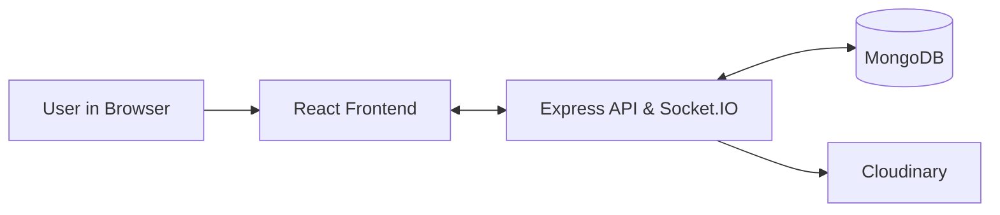
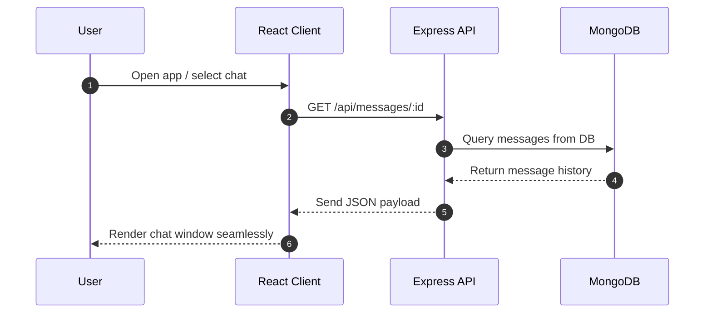

# 🏗️ ChatApp — System Design

> 📊 **Diagram visualizer:** To view all interactive diagrams in your browser without any extension, open [`preview.html`](./preview.html). To view them directly inside VS Code markdown preview (`Ctrl+Shift+V`), install the **Markdown Preview Mermaid Support** extension.

This document reflects the current implementation status of the project.

---

## 🌟 Overview

ChatApp is a highly scalable, real-time full-stack chat application composed of:

- A **React + Vite** frontend in the `client` folder.
- An **Express + Node.js** backend in the `server` folder.
- **MongoDB** persistence via **Mongoose**.
- **JWT-based authentication** and protected routes.
- **Cloudinary** integration for profile image uploads.
- **Socket.IO** integration for real-time messaging, presence, and typing indicators.

---

## 🏛️ Current Architecture

```mermaid
flowchart LR
    User[User in Browser] --> Client[React Frontend]
    Client <--> API[Express API & Socket.IO]
    API <--> DB[(MongoDB)]
    API --> Cloud[Cloudinary]
```

---

## 🧩 Core Components

### 🖥️ Frontend
- **React 19 with Vite**: Ensures lightning-fast rendering and an optimized build process.
- **React Router v7**: Powers single-page navigation and view management.
- **Tailwind CSS v4**: Implements utility-first, modern responsive UI.
- **Zustand / Context**: Handles client-side state across Socket and Auth events.
- **Views**: HomePage, LoginPage, and ProfilePage are currently active.

### ⚙️ Backend
- **Express Server**: Entry point defined in `server/server.js`.
- **Route Modules**: Cleanly separates auth and messaging endpoints.
- **Middleware**: Manages JWT verification and Zod payload validation.
- **Mongoose Models**: Schema definitions for `User` and `Message`.
- **Socket.IO Node**: Attaches to the Express HTTP server for WebSocket upgrades.

### 💾 Data Model
- **User**: `email`, `fullName`, `password`, `profilePic`, `bio`.
- **Message**: `senderId`, `receiverId`, `text`, `image`, `seen`, timestamps.

---

## 🔗 API Routes

| HTTP Method | Route | Purpose |
|-------------|-------|---------|
| `POST` | `/api/auth/signup` | Create a new account |
| `POST` | `/api/auth/login` | Sign in and issue JWT |
| `GET` | `/api/auth/check` | Validate authenticated session |
| `PUT` | `/api/auth/update-profile` | Update profile info and image via Cloudinary |
| `GET` | `/api/messages/users` | Fetch users for the chat sidebar |
| `GET` | `/api/messages/:id` | Fetch message history with a specific user |
| `POST` | `/api/messages/send/:id` | Send a new message |
| `GET` | `/api/status` | Server health check |

---

## ✉️ Message Flow

```mermaid
sequenceDiagram
    autonumber
    participant U as User
    participant C as React Client
    participant A as Express API
    participant D as MongoDB

    U->>C: Open app / select chat
    C->>A: GET /api/messages/:id
    A->>D: Query messages from DB
    D-->>A: Return message history
    A-->>C: Send JSON payload
    C-->>U: Render chat window seamlessly
```

---

## 📈 Implementation Status

| Area | Status | Comments |
|------|--------|----------|
| 🖥️ Frontend Shell | 🟢 Live | Complete with responsive design |
| 🔐 Auth API | 🟢 Live | JWT + Zod + bcrypt configured |
| 💬 Message API | 🟢 Live | Fetch and send messages active |
| 💾 DB Persistence | 🟢 Live | Mongoose models active |
| ☁️ Cloudinary Uploads | 🟢 Live | Handles profile images |
| ⚡ Real-Time WebSockets| 🟡 Partial | Handshake logic active; UI integration pending completion |

---

## 🎯 Next Milestones

- [ ] Complete Socket.IO event handling across all components.
- [ ] Implement global loading, error, and empty-state feedback.
- [ ] Finalize production build deployment configurations (e.g. Render, Vercel).
