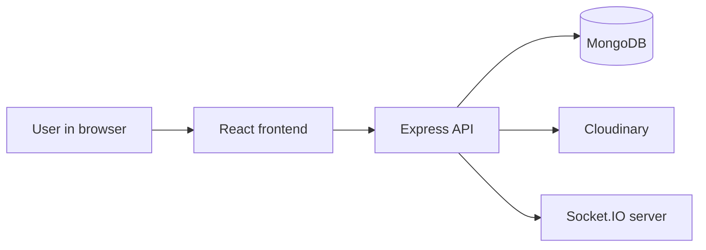
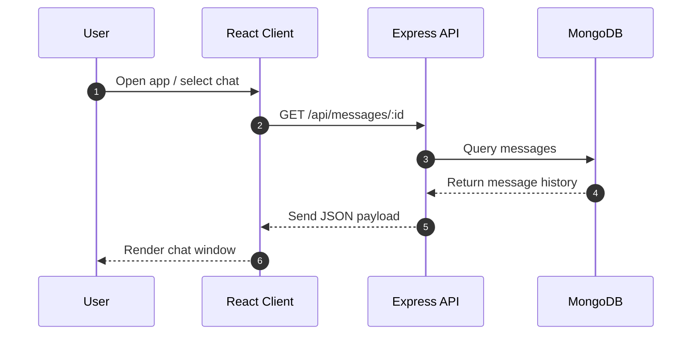

# ChatApp — System Design

This document reflects the current implementation status of the project as of August 2026.

## Overview

ChatApp is a full-stack chat application composed of:

- a React + Vite frontend in the client folder
- an Express + Node.js backend in the server folder
- MongoDB persistence via Mongoose
- JWT-based authentication and protected routes
- Cloudinary for profile image uploads
- Socket.IO for future real-time messaging

## Current architecture

```mermaid
flowchart LR
    User[User in browser] --> Client[React frontend]
    Client --> API[Express API]
    API --> DB[(MongoDB)]
    API --> Cloud[Cloudinary]
    API --> Socket[Socket.IO server]
```

## Components

### Frontend

- React 19 with Vite
- React Router for page navigation
- Tailwind CSS for styling
- HomePage, LoginPage, and ProfilePage are present
- Sidebar and chat area are rendered from the main page shell

### Backend

- Express server entry point in server/server.js
- Route modules for auth and messaging
- Middleware for JWT protection
- Mongoose models for users and messages

### Data model

- User: email, fullName, password, profilePic, bio
- Message: senderId, receiverId, text, image, seen, timestamps

## API routes

| Route | Purpose |
|------|---------|
| POST /api/auth/signup | Create a new account |
| POST /api/auth/login | Sign in and get JWT |
| GET /api/auth/check | Validate authenticated session |
| PUT /api/auth/update-profile | Update profile info and image |
| GET /api/messages/users | Fetch users for sidebar |
| GET /api/messages/:id | Fetch messages between the current user and another user |
| GET /api/messages/mark/:id | Mark a message as seen |
| GET /api/status | Health check |

## Message flow

```mermaid
sequenceDiagram
    autonumber
    participant U as User
    participant C as React Client
    participant A as Express API
    participant D as MongoDB

    U->>C: Open app / select chat
    C->>A: GET /api/messages/:id
    A->>D: Query messages
    D-->>A: Return message history
    A-->>C: Send JSON payload
    C-->>U: Render chat window
```

## Current implementation status

| Area | Status |
|------|--------|
| Frontend shell | Live |
| Authentication API | Live |
| Message API | Live |
| Database persistence | Live |
| Cloudinary image upload | Live |
| Real-time socket chat | Partial |

## Next milestones

- Connect the UI to live chat APIs instead of static demo data
- Complete Socket.IO event handling for real-time send/receive
- Add loading, error, and empty-state handling
- Prepare deployment configuration for frontend and backend

