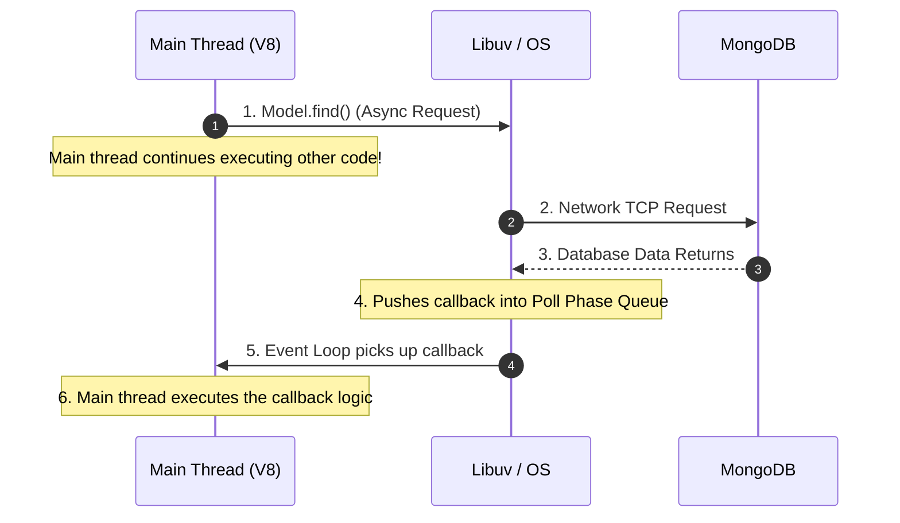

# 🌟 Node.js - Comprehensive Interview Question Bank (With Answers)

## 🚀 LEVEL 1: Node.js Fundamentals

**1. What is Node.js, and what makes it different from a browser's JavaScript engine?**
**A (Layer 1):** Node.js is a runtime environment that allows you to run JavaScript on the server.
**A (Layer 2):** While browsers have JS engines (like Chrome's V8) coupled with Web APIs (DOM, `window`, `document`), Node.js takes that same V8 engine and couples it with C++ bindings (via `libuv`) to interact directly with the Operating System. This gives JavaScript the ability to read files, open network sockets, and connect to databases—things explicitly forbidden in a browser.

**2. Is Node.js single-threaded or multi-threaded? Explain your answer.**
**A (Layer 1):** It is single-threaded for executing JavaScript, but multi-threaded under the hood.
**A (Layer 2):** Your JavaScript code executes on a single main thread (one Call Stack). However, Node.js offloads heavy asynchronous tasks (like File System operations or crypto hashing) to the C++ `libuv` library, which maintains a background Thread Pool (default 4 threads). So while you only write single-threaded code, the OS executes it concurrently.

**3. What is the V8 Engine, and what is its role in Node.js?**
**A (Layer 1):** It is the engine created by Google that reads your JavaScript and executes it.
**A (Layer 2):** V8 takes human-readable JavaScript, parses it, creates an Abstract Syntax Tree (AST), and uses its JIT (Just-In-Time) compiler (Ignition and TurboFan) to compile it directly into machine code the CPU can execute. V8 also manages memory allocation and Garbage Collection.

**4. What is `libuv`, and why is it essential to Node.js?**
**A (Layer 1):** It's the library that gives Node.js its asynchronous power.
**A (Layer 2):** `libuv` is a multi-platform C library that provides Node.js with the Event Loop and the Worker Thread Pool. Without it, Node.js would just be a synchronous calculator. `libuv` bridges V8 to the OS, handling non-blocking network I/O via `epoll` (Linux) or `kqueue` (Mac).

**5. Explain the difference between Synchronous and Asynchronous programming in Node.js.**
**A (Layer 1):** Sync blocks the server until a task finishes. Async lets the server do other things while waiting.
**A (Layer 2):** In Sync (`fs.readFileSync`), the V8 thread halts completely. If a file takes 5 seconds to read, no other user can access your website for 5 seconds. In Async (`fs.readFile`), Node hands the task to the OS, immediately moves to the next line of code, and handles the file data later via a callback/promise when the OS finishes.

**6. What is non-blocking I/O?**
**A (Layer 1):** It means Input/Output operations (database, network, files) don't block the main thread.
**A (Layer 2):** When an Express route queries MongoDB, Node.js fires the network request via `libuv` and then suspends that specific function context. The main thread immediately grabs the next pending HTTP request and starts processing it. This allows Node to handle thousands of concurrent connections on one thread.

**7. What is the difference between `require()` (CommonJS) and `import` (ES Modules)?**
**A (Layer 1):** `require` is the older Node format. `import` is the modern ES6 format.
**A (Layer 2):** CommonJS (`require`) is synchronous and dynamic (you can conditionally require a file inside an `if` block). ESM (`import`) is asynchronous and static (must be declared at the top level). Because ESM is static, Node can analyze the code before running it, enabling "Tree Shaking" to remove unused code and reduce memory footprint.

**8. What is `process.env` and why is it used?**
**A (Layer 1):** It stores secret environment variables like database passwords.
**A (Layer 2):** `process` is a global Node object representing the current execution context. `.env` reads variables injected by the OS or hosting provider (like Render/Heroku). We use it so we don't hardcode sensitive API keys into GitHub, and so we can dynamically change ports (`PORT=5000`) without changing code.

**9. Explain what `package.json` and `package-lock.json` do.**
**A (Layer 1):** `package.json` lists the libraries you need. `package-lock.json` locks the exact versions.
**A (Layer 2):** `package.json` specifies broad version ranges (e.g., `^1.2.0`, meaning any 1.x version is fine). If a teammate runs `npm install` 6 months later, they might get `1.9.0` which breaks the app. `package-lock.json` records the exact byte-for-byte version tree (e.g., exactly `1.2.4`) installed originally, guaranteeing deterministic builds across all machines.

**10. What are the global objects available in Node.js?**
**A (Layer 1):** `__dirname`, `__filename`, `module`, `require`, `process`, `setTimeout`.
**A (Layer 2):** In browsers, the global object is `window`. In Node, it is `global`. Interestingly, `__dirname` and `require` aren't actually true globals! Node.js wraps every file in an IIFE (Immediately Invoked Function Expression) called the "Module Wrapper" before executing it, injecting those variables as local arguments into your file.

---

## 🚀 LEVEL 2: The Event Loop & Architecture

**11. Explain the Node.js Event Loop. Why is it the most important concept in Node?**
**A (Layer 1):** It's the infinite loop that constantly checks for finished background tasks and runs their callbacks.
**A (Layer 2):** The Event Loop is the orchestrator of Node's non-blocking I/O. It spins continuously as long as there are pending callbacks or active servers. It offloads heavy tasks, waits for the OS to signal completion, and then pushes the corresponding `.then()` or callback function back onto the V8 Call Stack to be executed by the main thread.

**12. What are the different phases of the Event Loop?**
**A (Layer 1):** Timers, Pending Callbacks, Poll, Check, and Close.
**A (Layer 2):** 
1. **Timers:** Executes `setTimeout` / `setInterval` callbacks.
2. **Pending Callbacks:** Executes I/O callbacks deferred to the next loop iteration (TCP errors).
3. **Poll:** Retrieves new I/O events (HTTP requests, DB responses). It blocks here if no other tasks are pending.
4. **Check:** Executes `setImmediate()` callbacks.
5. **Close:** Executes `socket.on('close')` callbacks.

**13. In which phase of the Event Loop do `setTimeout` and `setInterval` execute?**
**A:** The Timers phase (the very first phase of the loop).

**14. In which phase do I/O operations (like reading a file or database querying) execute?**
**A:** The Poll phase.

**15. What is the difference between `setImmediate()` and `setTimeout(fn, 0)`?**
**A (Layer 1):** They both try to run code "as soon as possible", but in different loop phases.
**A (Layer 2):** `setTimeout(fn, 0)` goes into the Timers phase. `setImmediate()` goes into the Check phase. If called from the main module, execution order is unpredictable due to startup delays. But if called *inside an I/O callback* (like an HTTP route), `setImmediate` is guaranteed to fire first because the Poll phase immediately transitions into the Check phase.

**16. What is `process.nextTick()`, and how does it relate to the Event Loop?**
**A (Layer 1):** It tells Node to run a function immediately before doing anything else.
**A (Layer 2):** `process.nextTick()` is technically NOT part of the Event Loop phases. It maintains its own internal queue. The moment the current JavaScript operation finishes, Node halts the Event Loop completely and drains the entire `nextTick` queue before allowing the loop to proceed to the next phase.

**17. What is the Node.js Thread Pool (Worker Pool)? How many threads does it have by default?**
**A (Layer 1):** It's a pool of 4 background threads used for heavy lifting.
**A (Layer 2):** It is managed by `libuv`. You can increase it by setting the environment variable `UV_THREADPOOL_SIZE=8`.

**18. Which types of operations are offloaded to the Thread Pool?**
**A:** CPU-intensive cryptography (`bcrypt`, `crypto`), Zlib compression, and File System (`fs`) operations. (Note: Network I/O does NOT use the thread pool; it uses OS async primitives).

**19. If Node.js is single-threaded, how can it handle 10,000 concurrent requests without freezing?**
**A (Layer 1):** By delegating the waiting time to the Operating System.
**A (Layer 2):** When 10,000 users request data from MongoDB, Node doesn't wait. It fires 10,000 network requests through the OS (`epoll`). The OS tracks the sockets. When the database replies, the OS notifies `libuv`, which pushes the callback to the Event Loop's Poll phase. The main thread only spends a few microseconds executing the JavaScript logic for each request.

**20. What is a CPU-bound task vs an I/O-bound task? Which one is Node.js bad at?**
**A (Layer 1):** CPU-bound requires heavy math (video encoding). I/O-bound requires waiting (database queries). Node is bad at CPU-bound tasks.
**A (Layer 2):** Node shines at I/O-bound tasks because it delegates the waiting. But if you try to process a massive `while` loop or encode a video in JavaScript, the single V8 thread locks up. The Event Loop stops spinning. All other connected users will freeze and time out because the single thread is occupied with math.

---

## 🚀 LEVEL 3: Buffers, Streams, & Events

**21. What is an `EventEmitter` in Node.js? How does the Observer pattern work here?**
**A (Layer 1):** It allows objects to broadcast named events and other objects to listen to them.
**A (Layer 2):** It is the core of Node's async architecture (Socket.IO, HTTP requests, Streams all inherit from it). It maintains a synchronous registry object: `{ "eventName": [callback1, callback2] }`. When `.emit("eventName")` is called, it synchronously loops through the array and fires every callback.

**23. What is a Buffer in Node.js? Why do we need it instead of just using Strings?**
**A (Layer 1):** Buffers hold raw binary data (0s and 1s) directly in memory.
**A (Layer 2):** JavaScript strings are UTF-16 encoded and designed for text. When you receive an image upload or an encrypted TCP packet, it is binary data. A Buffer allocates a fixed-size chunk of raw memory outside the V8 engine's heap, allowing Node to process files and network streams efficiently without string conversion overhead.

**24. What are Streams in Node.js?**
**A (Layer 1):** Streams let you read/write data piece by piece instead of all at once.
**A (Layer 2):** 
- 💡 **Readable:** Data coming in (e.g., `fs.createReadStream`, incoming HTTP requests).
- 💡 **Writable:** Data going out (e.g., `res` object in Express).
- 💡 **Duplex:** Both (e.g., WebSockets, TCP sockets).
- 💡 **Transform:** Modifies data as it passes through (e.g., Zlib compression).

**25. Why is streaming a large file better than reading it into memory all at once?**
**A (Layer 1):** It saves RAM.
**A (Layer 2):** If 10 users upload a 100MB video simultaneously and you use `fs.readFile`, Node loads 1GB into V8's memory, causing an Out of Memory crash. With Streams, Node takes a 64KB chunk of the video, writes it to the disk/Cloudinary, discards it from RAM, and grabs the next chunk. Max RAM usage stays at ~64KB.

---

## 🚀 LEVEL 4: Error Handling & Memory Management

**27. How does Garbage Collection work in V8?**
**A (Layer 1):** It automatically deletes objects from RAM that are no longer being used.
**A (Layer 2):** V8 uses a generational Mark-and-Sweep algorithm. It starts at the "root" (global object/active call stack) and traces every variable reference. Any object that cannot be reached (e.g., an abandoned array) is marked as "dead" and swept from memory during a "Stop-The-World" pause.

**28. What causes a Memory Leak in a Node.js application?**
**A (Layer 1):** Keeping data in global variables and forgetting to delete it.
**A (Layer 2):** The most common leaks are: 
1. Pushing data to a global array/object (`userSocketMap`) and never removing it on disconnect.
2. Forgotten closures holding onto large variables.
3. Attaching event listeners (`socket.on`) without calling `socket.off`, causing duplicate callback references that GC cannot clean up.

**30. If a Node.js process crashes, how do you ensure it restarts automatically?**
**A:** Node.js does not auto-restart by itself. In production, you must use a process manager like **PM2** or run it inside a **Docker container** managed by Kubernetes/ECS, which detects the non-zero exit code and spins up a new instance instantly.

**31. What is the purpose of the `cluster` module in Node.js?**
**A (Layer 1):** It allows Node to use all CPU cores instead of just one.
**A (Layer 2):** `cluster` allows you to fork the main Node process into multiple child workers (e.g., 8 workers for an 8-core CPU). The main master process listens on Port 5000 and uses a Round-Robin algorithm to distribute incoming HTTP requests to the workers, massively increasing throughput.

---

## 🚀 LEVEL 5: Cross-Question Chains

**Chain 1: Event Loop Drill**
- 💡 **33a: What happens when you call a database query in Node?** (A: Node sends the network request to the OS via libuv and moves on).
- 💡 **33b: → Does the main thread wait?** (A: No, it continues executing the next line of code).
- 💡 **33c: → Where does the callback go while waiting?** (A: It waits in the OS space/C++ side).
- 💡 **33d: → In what phase of the event loop is the callback finally executed?** (A: When the DB replies, the callback is queued in the Poll phase queue, and the main thread executes it).

---

## 🚀 LEVEL 6: Project-Specific Implementation (ChatApp)

**35. In your `signup` controller, you use `await bcrypt.hash()`. Why must this be asynchronous?**
**A:** `bcrypt` is extremely CPU-intensive (intentionally, to defeat brute-force hacks). Because it's async, `libuv` pushes this math to the Thread Pool. 

**36. What would happen to your other users' chat messages if you used `bcrypt.hashSync()` instead?**
**A:** `hashSync` runs on the main V8 thread. The Event Loop would completely halt for the ~300ms it takes to generate the hash. During that time, no other user could send a message, connect to Socket.IO, or log in. The server would freeze.

**37. You store `userSocketMap` in memory. Explain the lifecycle of an object in this map and how V8 garbage collects it.**
**A:** When a user connects, we assign `userSocketMap[userId] = socket.id`. This string is now referenced by the global map, so GC ignores it. When they drop offline, we *must* execute `delete userSocketMap[userId]`. This severs the reference. The next time V8 runs its Mark-and-Sweep, it realizes the string is unreachable and frees the RAM.

**38. In `getUsersForSidebar`, you use `await Promise.all(promises)`. What is the mechanical difference in Node between `Promise.all` and a sequential `for...await` loop?**
**A:** A sequential loop pauses execution at `await` before sending the next DB query. `Promise.all` immediately fires *all* MongoDB queries concurrently through `libuv`. The database executes them simultaneously, drastically reducing response time from (Users * Latency) to just (~Latency).

**39. What is the "fail-fast" trap of using `Promise.all` in your sidebar query?**
**A:** If finding unread messages fails for even *one* single user, the entire `Promise.all` immediately throws an error, crashing the request for all users. Using `Promise.allSettled` is safer.

**40. You are receiving Base64 image strings from the frontend. How does the V8 engine process and buffer this large payload?**
**A:** The base64 string arrives over TCP in chunks. `express.json({ limit: "15mb" })` uses internal Node Streams to collect these chunks into a raw Buffer outside V8 heap memory. Once fully received, it converts the Buffer into a UTF-16 JavaScript String and attaches it to `req.body.image`.

**42. How does the single-threaded nature of Node.js make storing `userSocketMap` locally safe from Race Conditions, but dangerous for Horizontal Scaling?**
**A:** Because Node has only one thread, two users connecting simultaneously cannot overwrite each other's data at the exact same microsecond—Node processes them one by one, making local memory thread-safe. However, if we horizontally scale to 3 Node servers (3 separate processes), they do not share memory. Server A's map is invisible to Server B, entirely breaking the Socket.IO messaging logic unless we use Redis.

---

## 🚀 Explanatory Diagram

### 📌 The Event Loop in Action (Database Query)

