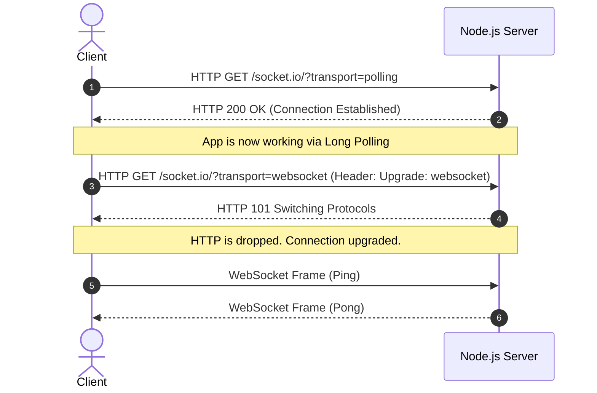
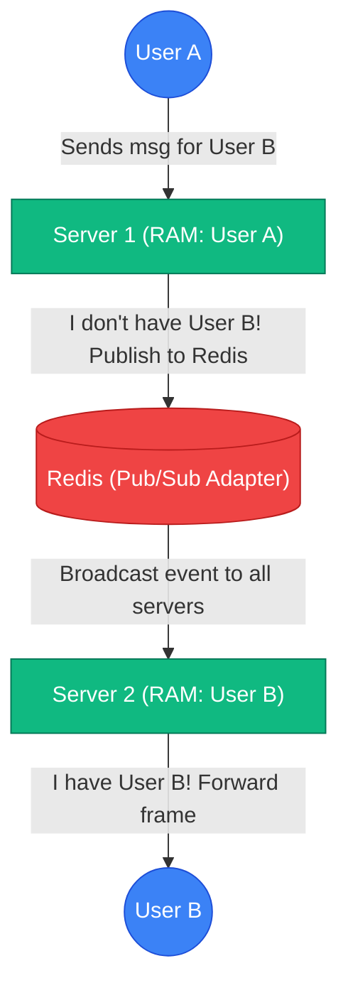

# 🌟 Socket.IO & WebSocket - Master Interview Question Bank (With Answers)

## 🚀 1. Coverage Map
*(Same as previously defined)*

---

## 🚀 2. Master Question Bank

### 📌 LEVEL 1 — FUNDAMENTALS

**Q1. What exactly is WebSocket, and what fundamental limitation of HTTP does it solve?**
**Tests:** Persistent connection, full-duplex communication.
**A (Layer 1):** WebSocket is a protocol that allows continuous, two-way communication over a single connection. It solves HTTP's limitation where the server cannot initiate sending data to the client.
**A (Layer 2):** HTTP is strictly half-duplex and Request/Response based. The client must ask for data. To achieve real-time updates with HTTP, the client must repeatedly "poll" the server, which wastes bandwidth via repetitive HTTP headers and creates latency. WebSocket solves this by keeping a single TCP pipe permanently open, allowing the server to *push* data to the client the millisecond it's available.

**Q2. Explain the difference between HTTP Polling, HTTP Long Polling, and WebSocket.**
**Tests:** Evolution of real-time communication.
**A (Layer 1):** Polling asks every second. Long Polling asks and waits. WebSocket keeps the door open forever.
**A (Layer 2):** 
- 💡 **Polling:** Client sends `GET /messages` every 1 sec. Server replies immediately (often with empty data). Massive overhead.
- 💡 **Long Polling:** Client sends `GET /messages`. Server holds the request open until a message arrives, sends it, and the connection closes. Client immediately opens a new request.
- 💡 **WebSocket:** A single HTTP request upgrades the connection. The TCP connection stays open indefinitely, and data flows bidirectionally with tiny frame headers (as little as 2 bytes).

**Q3. Why is WebSocket uniquely suited for a chat application compared to standard REST APIs?**
**Tests:** Practical application of full-duplex communication.
**A (Layer 1):** Because users need to see messages the exact second they are sent, without having to refresh the page.
**A (Layer 2):** Chat requires extremely low-latency "push" capabilities (like typing indicators). REST APIs require the client to pull data. If we used REST, user B wouldn't see user A's message until their browser happened to send the next polling request, resulting in a laggy, terrible UX.

---

### 📌 LEVEL 2 — WEBSOCKET CONNECTION MECHANICS

**Q4. Describe the WebSocket Handshake. Why does it start as an HTTP request?**
**Tests:** HTTP Upgrade header, 101 Switching Protocols.
**A (Layer 1):** It starts as HTTP so it can bypass standard web firewalls, then asks to upgrade to WebSocket.
**A (Layer 2):** The client sends a standard HTTP GET request with two special headers: `Connection: Upgrade` and `Upgrade: websocket`. If the server supports it, it replies with an HTTP `101 Switching Protocols` status code. This initial HTTP phase ensures that proxies and firewalls that only understand HTTP don't immediately block the connection.

**Q5. Once the HTTP connection is upgraded to WebSocket, does HTTP continue to carry the messages?**
**Tests:** Protocol switching, TCP persistence.
**A (Layer 1):** No. HTTP is completely discarded after the handshake.
**A (Layer 2):** HTTP is just the vehicle for the handshake. Once the `101` response is sent, the HTTP protocol is dropped. From that exact TCP socket, communication switches entirely to the WebSocket protocol, which uses lightweight binary/text frames instead of bulky HTTP headers.

**Q6. What is the difference between `ws://` and `wss://`? How does this relate to TLS/SSL?**
**Tests:** Security, encryption layers.
**A (Layer 1):** `ws://` is unencrypted WebSocket, `wss://` is secure (encrypted) WebSocket.
**A (Layer 2):** It is the exact same relationship as HTTP vs HTTPS. `wss://` means the WebSocket protocol is running over TLS (Transport Layer Security). In production, you must always use `wss://` to prevent Man-In-The-Middle (MITM) attacks from reading your plaintext chat data.

**Q7. Explain the relationship between your Chat Application, WebSocket, TCP, and IP.**
**Tests:** OSI Model / Network stack understanding.
**A (Layer 1):** The App uses WebSocket, WebSocket runs on TCP, and TCP runs on IP.
**A (Layer 2):** 
- 💡 **Application Layer:** Your React/Node code defines what the message says ("Hello").
- 💡 **WebSocket Layer:** Wraps "Hello" in a data frame.
- 💡 **Transport Layer (TCP):** Chops the frame into packets, ensuring they arrive in order and without errors.
- 💡 **Network Layer (IP):** Routes those packets across the physical internet using IP addresses.

---

### 📌 LEVEL 3 — WEBSOCKET DATA/COMMUNICATION MODEL

**Q8. Does the WebSocket protocol itself guarantee message delivery?**
**Tests:** TCP guarantees vs Application-level guarantees.
**A (Layer 1):** No. It relies on TCP to ensure packets arrive, but it doesn't guarantee the application processed them.
**A (Layer 2):** TCP guarantees that if a packet is sent, it reaches the destination OS in order, or the connection drops. However, WebSocket does NOT have built-in application-level acknowledgements (like HTTP's 200 OK). If the server OS receives the message but Node.js crashes before saving it, the message is lost.

**Q9. If a WebSocket connection breaks while a message is in transit, does WebSocket automatically queue it for retry?**
**Tests:** Persistence, Application-level retry mechanics.
**A (Layer 1):** No. Raw WebSocket does not queue or retry messages.
**A (Layer 2):** WebSocket is a "dumb" pipe. If the TCP connection snaps, any message currently in flight is permanently destroyed. To get queuing and automatic retries, you have to build that logic yourself on the client side, or use a higher-level library like Socket.IO (which handles basic connection retries, though not guaranteed message persistence).

**Q10. Since WebSocket is full-duplex, is message ordering guaranteed?**
**Tests:** TCP underlying packet ordering.
**A (Layer 1):** Yes, messages arrive in the exact order they were sent.
**A (Layer 2):** Because WebSocket runs over a single TCP connection, it inherits TCP's ordering guarantees. If User A sends Message 1 then Message 2, TCP's sequence numbers guarantee the server receives Message 1 before Message 2.

---

### 📌 LEVEL 4 — HEARTBEAT / CONNECTION HEALTH

**Q11. Why is a heartbeat mechanism necessary for long-lived WebSocket connections?**
**Tests:** Silent TCP drops, NAT timeouts, Half-open connections.
**A (Layer 1):** To check if the other person's internet randomly died without them telling us.
**A (Layer 2):** If a user clicks "Close Tab", the browser cleanly sends a TCP FIN packet, closing the socket instantly. But if a user drives into a tunnel and loses 4G, their phone never sends a disconnect packet. This leaves a "Half-Open" connection on the server. Without a heartbeat, the server would keep this ghost connection in memory forever.

**Q12. Explain the Ping/Pong concept. Who initiates it, and what happens if a Pong is missed?**
**Tests:** Engine.IO pingInterval and pingTimeout.
**A (Layer 1):** The server sends a Ping. The client must reply with a Pong.
**A (Layer 2):** In Socket.IO (via Engine.IO), the server periodically sends a Ping packet (e.g., every 25 seconds). If the client doesn't reply with a Pong within a specific timeout (e.g., 20 seconds), the server assumes the client is dead, forcefully destroys the socket, and fires the `disconnect` event.

**Q13. What is the difference between a TCP connection being technically alive and the application knowing the client is actively responding?**
**Tests:** Transport layer vs Application layer health.
**A (Layer 1):** The OS might think the connection is open, but the React app might be frozen.
**A (Layer 2):** A TCP connection can remain technically established at the OS level even if the browser tab is frozen or the Node.js event loop is completely blocked. A Ping/Pong happens at the *Application Layer* (WebSocket/Engine.IO). It proves not just that the wire is connected, but that the application itself is alive and processing events.

---

### 📌 LEVEL 5 — ENGINE.IO / TRANSPORTS

**Q14. What is the specific role of Engine.IO in the Socket.IO ecosystem?**
**Tests:** Connection management vs Event management.
**A (Layer 1):** Engine.IO is the engine that keeps the connection alive. Socket.IO handles the fun stuff like events.
**A (Layer 2):** Engine.IO is the low-level transport layer. It is responsible for establishing the connection, handling the Ping/Pong heartbeat, and negotiating transports (Polling vs WebSocket). Socket.IO sits on top of Engine.IO and provides the high-level API (namespaces, broadcasting, acknowledgements).

**Q15. Why does Socket.IO often establish a connection using HTTP Long Polling first, before upgrading to WebSocket?**
**Tests:** Network compatibility, firewall traversal.
**A (Layer 1):** To guarantee a connection works immediately, even on bad networks.
**A (Layer 2):** This is called the "Polling First" strategy. If Socket.IO tried WebSocket first and it failed (due to corporate firewalls blocking port 80/443 WebSockets), the user would sit there for 10 seconds waiting for a timeout before the app worked. By starting with HTTP Polling, the connection is established instantly (since HTTP always works). In the background, it silently attempts to upgrade to WebSocket.

**Q16. If a corporate firewall completely blocks WebSocket traffic, what happens to a Socket.IO connection?**
**Tests:** Fallback mechanisms, Transport layer.
**A (Layer 1):** It falls back to using HTTP Long Polling automatically.
**A (Layer 2):** The real-time chat will still work perfectly! Engine.IO will simply continue using HTTP Long Polling. The API (`socket.emit`) remains completely unchanged for the developer. This fallback reliability is the primary reason developers choose Socket.IO over raw WebSockets.

---

### 📌 LEVEL 6 — SOCKET.IO FUNDAMENTALS & EVENTS

**Q17. Socket.IO is often confused with WebSocket. If an interviewer says "Socket.IO is just a wrapper around WebSocket", how do you correct them?**
**Tests:** Fallbacks, auto-reconnect, custom packet formats.
**A (Layer 1):** Socket.IO is not a wrapper; it's a higher-level library that *uses* WebSocket but adds its own custom features.
**A (Layer 2):** Raw WebSockets only send text or binary frames. Socket.IO adds a custom packet format to support named events (`socket.on('typing')`), automatic reconnections, HTTP Polling fallbacks, and broadcasting. Because of this custom protocol, a raw WebSocket client cannot connect to a Socket.IO server, and vice versa.

**Q18. What is the difference between `io.emit()` and `socket.emit()`?**
**Tests:** Global broadcast vs Targeted emission.
**A (Layer 1):** `io.emit` screams to everyone. `socket.emit` whispers to one person.
**A (Layer 2):** `io.emit()` broadcasts the event to every single socket currently connected to the server (useful for "Server going down for maintenance"). `socket.emit()` triggers an event on that specific client's connection (used on the backend to reply to the sender, or on the frontend to send data to the server).

**Q19. How do Acknowledgement Callbacks work in Socket.IO, and when would you use them in a chat app?**
**Tests:** Request/Response simulation over WebSockets.
**A (Layer 1):** It's a way to get a "success" reply when you emit an event.
**A (Layer 2):** In raw WebSocket, you just throw data down the pipe and hope it arrives. In Socket.IO, you can attach a callback function as the last argument to `.emit()`. The server processes the event and executes the callback, which triggers the function back on the client. It perfectly simulates an HTTP Request/Response cycle over WebSockets.

---

### 📌 LEVEL 7 — CONNECTION LIFECYCLE & RECONNECTION

**Q20. When a user closes their browser tab, what exactly happens on the server?**
**Tests:** TCP FIN, 'disconnect' event.
**A (Layer 1):** The server detects the closure and fires the `disconnect` event.
**A (Layer 2):** The browser sends a TCP FIN packet to gracefully close the connection. Engine.IO receives this, destroys the underlying socket, and emits the `disconnect` event to Socket.IO. We catch this in `io.on('connection')` to delete the user from our `userSocketMap` and broadcast the updated online list.

**Q21. Why does Socket.IO feature automatic reconnection, and what triggers it?**
**Tests:** Network loss, Engine.IO timeouts.
**A (Layer 1):** Because mobile networks are unstable. If you lose WiFi, Socket.IO tries to fix it for you.
**A (Layer 2):** If the Engine.IO Ping/Pong fails (e.g., WiFi drops), the connection drops. The Socket.IO client has a built-in `Manager` that immediately begins attempting to reconnect with an exponential backoff (e.g., trying at 1s, 2s, 4s, 8s).

**Q22. [TRAP] When a client automatically reconnects after a 10-second WiFi drop, do they keep the exact same `socket.id` on the server?**
**Tests:** Socket instance lifecycle, ID regeneration.
**A (Layer 1):** No. They get a brand new `socket.id`.
**A (Layer 2):** This is a huge trap. A "reconnection" in Socket.IO is actually establishing a brand new Engine.IO connection from scratch. The old `socket` object on the server was destroyed and garbage collected. This is why you must NEVER rely on `socket.id` as a permanent identifier for a user in a database.

**Q23. Because of how reconnection works, why must the server manually rebuild the `userId -> socket.id` mapping upon every connection event?**
**Tests:** Stateful application logic, mapping synchronization.
**A (Layer 1):** Because the `socket.id` changes every time their network hiccups.
**A (Layer 2):** If User A drops off WiFi, their old `socket.id` is deleted from `userSocketMap`. When they auto-reconnect 5 seconds later, they get a new `socket.id`. The server's `io.on('connection')` block runs again, pulling their `userId` from the handshake query, and maps it to the *new* `socket.id`. If we didn't do this, messages to that `userId` would route to a dead socket ID.

---

### 📌 LEVEL 8 — AUTHENTICATION / HANDSHAKE

**Q24. What is the difference between connecting to a socket and authenticating a socket?**
**Tests:** Transport establishment vs Application permission.
**A (Layer 1):** Connecting means the wire is plugged in. Authenticating means verifying who is using the wire.
**A (Layer 2):** Anyone can run a script to establish a WebSocket TCP connection to your server port. Authentication is an application-level concern. You must intercept the handshake, verify a token, and aggressively disconnect the socket if they don't have proof of identity.

**Q25. In your project, you pass `userId` in the `socket.handshake.query`. Why is this highly insecure for a production application?**
**Tests:** Identity spoofing, lack of cryptographic verification.
**A (Layer 1):** Because anyone can fake a `userId` and pretend to be someone else.
**A (Layer 2):** If an attacker opens Chrome DevTools and looks at your network traffic, they will see `?userId=123`. They can write a script to connect to your Socket.IO server using `?userId=456` (the CEO's ID). Now, your server maps the CEO's ID to the hacker's socket, routing all the CEO's private messages to the hacker!

**Q26. How would you properly authenticate a Socket.IO connection using a JWT?**
**Tests:** `auth` payload, `io.use()` middleware.
**A (Layer 1):** Pass the JWT token from the client, and verify it in a Socket.IO middleware on the server.
**A (Layer 2):** 
1. Client: `io("url", { auth: { token: localStorage.getItem("token") } })`
2. Server: `io.use((socket, next) => { ... })`
3. The server extracts `socket.handshake.auth.token`, runs `jwt.verify()`, and extracts the *real* `userId` cryptographically. If it fails, call `next(new Error("unauthorized"))`, which forcefully aborts the connection.

---

### 📌 LEVEL 9 — REALTIME CHAT DESIGN

**Q27. Why use HTTP (Axios) to send a message to MongoDB, but use Socket.IO to deliver it to the receiver? Why not just use Socket.IO for both?**
**Tests:** Separation of concerns, REST semantics.
**A (Layer 1):** HTTP is great for standard database operations. Socket.IO is just for the real-time notification.
**A (Layer 2):** You *could* do it all over Socket.IO (`socket.emit('sendMessage')`). However, using REST HTTP for sending ensures standard stateless API design. We get standard HTTP status codes, robust Express error handling middleware, and easy integration with Zod validation. We treat Socket.IO purely as the "Delivery Boy" notifying the receiver, keeping responsibilities separate.

**Q28. What happens if the HTTP request successfully saves the message to MongoDB, but the receiver is currently offline?**
**Tests:** Asynchronous delivery, source of truth.
**A (Layer 1):** The message stays safely in the database. When the receiver logs in later, they fetch it via HTTP.
**A (Layer 2):** This highlights why the Database is the "Source of Truth". The server tries to find the receiver in `userSocketMap`. It fails. It simply skips the `io.to().emit()` step. The sender still gets a 200 OK from HTTP. When the receiver opens the app tomorrow, their React component runs an Axios GET request to fetch chat history from MongoDB, pulling down the message.

**Q29. What happens if the Socket.IO emission succeeds, but the database save fails?**
**Tests:** Data inconsistency, atomic operations.
**A (Layer 1):** The receiver sees the message, but it disappears when they refresh the page.
**A (Layer 2):** This is a severe state inconsistency. The receiver gets the real-time ping and reads the message in React state. But because MongoDB threw an error, it was never persisted. If the receiver refreshes, the message vanishes. This is why in our controller, we **always execute `await Message.create()` BEFORE calling `io.to().emit()`**.

---

### 📌 LEVEL 10 — SCALING / REAL SYSTEM CONCERNS

**Q30. You are storing `userSocketMap` as a plain JavaScript object in Node memory. What happens when you deploy it across 3 different Node servers behind a Load Balancer?**
**Tests:** Stateful bottlenecks, sticky sessions.
**A (Layer 1):** The chat breaks because Server A doesn't know who is connected to Server B.
**A (Layer 2):** If User X (on Server A) sends a message to User Y (on Server B), Server A looks at its local `userSocketMap` RAM. It doesn't see User Y. It assumes User Y is offline and skips the emission. Furthermore, Socket.IO's HTTP Long Polling phase will break if the load balancer sends the handshake to Server A, but the subsequent poll to Server B. You MUST enable "Sticky Sessions" on the load balancer to fix the polling issue.

**Q31. User A is connected to Server 1. User B is connected to Server 2. How do you ensure User A's message reaches User B?**
**Tests:** Redis Adapter, Pub/Sub pattern.
**A (Layer 1):** You use a Redis server as a middleman to broadcast events across all servers.
**A (Layer 2):** You implement the `@socket.io/redis-adapter`. When Server A wants to emit to User Y's socket (which it doesn't have), Server A publishes the event to Redis. Redis broadcasts this event to ALL Node servers. Server B receives it, realizes "Hey, I have User Y's socket!", and pushes the WebSocket frame down to User Y.

---

### 📌 LEVEL 11 — FAILURE SCENARIOS / TRAPS

**Q32. What if the same user opens your ChatApp in two different browser tabs?**
**Tests:** Handling multiple socket IDs for a single User ID.
**A (Layer 1):** The current app will overwrite the `socket.id` mapping, breaking chat on the first tab.
**A (Layer 2):** Because we use `userSocketMap[userId] = socket.id`, the second tab opening overwrites the value with the second tab's `socket.id`. The first tab will no longer receive any `newMessage` events! To fix this, `userSocketMap` should map to an *Array* of socket IDs: `userSocketMap[userId] = [socket1, socket2]`. We must then loop through the array and `io.to().emit()` to all of them.

**Q33. What if an event listener (`socket.on('newMessage')`) is registered inside a React component without a cleanup function (`socket.off()`)?**
**Tests:** Memory leaks, duplicate event processing.
**A (Layer 1):** Every time the component re-renders, it creates a new listener. You'll get ghost messages.
**A (Layer 2):** If `ChatContainer` re-renders 5 times, there are now 5 identical listeners sitting in memory. When the server emits exactly one `newMessage` event, React executes all 5 listeners simultaneously, adding the message to your chat UI 5 times. Always return `() => socket.off('newMessage')` in your `useEffect`.

---

### 📌 LEVEL 12 — INTERVIEW CROSS-QUESTION CHAINS

**CHAIN 1: The WebSocket Drill**
* **Q35a: What is WebSocket?** (A: Full-duplex persistent protocol over TCP).
* **Q35b: → How exactly is it different from HTTP?** (A: HTTP is request/response, WS is bidirectional push).
* **Q35c: → Does the handshake use HTTP?** (A: Yes, it uses the Upgrade header).
* **Q35d: → What happens immediately after the Upgrade header is accepted?** (A: HTTP is dropped, binary/text frame communication begins on the raw socket).
* **Q35e: → Does WebSocket guarantee that your chat message actually reached the other person's screen?** (A: No, only that it reached the OS network layer).
* **Q35f: → If not, how would you design your app to ensure reliable delivery?** (A: Implement application-level Acknowledgement callbacks and save to DB first).

**CHAIN 2: The Socket.IO Drill**
* **Q36a: Why did you choose Socket.IO over native WebSockets?** (A: Fallbacks, auto-reconnect, named events).
* **Q36b: → What is Engine.IO?** (A: The lower-level transport layer handling Ping/Pong and upgrades).
* **Q36c: → Why does it start with Polling?** (A: To ensure instant connection success before testing if firewalls allow WS).
* **Q36d: → If a client's WiFi drops for 5 seconds and reconnects, do they get the messages they missed during those 5 seconds automatically?** (A: No. Socket.IO reconnects the transport, but does not replay missed events by default).
* **Q36e: → How do you sync the client with the database after a reconnection?** (A: Hook into the `socket.on('connect')` event on the frontend to trigger an Axios GET request to pull the latest history from MongoDB).

**CHAIN 3: The Scaling Drill**
* **Q37a: Your app is getting slow. You spin up a second server. Why did the chat just break?** (A: State is stored locally in RAM. Server A doesn't know Server B's sockets).
* **Q37b: → What is a Load Balancer's role here, and what are "Sticky Sessions"?** (A: It routes traffic. Sticky sessions force a client's HTTP polling requests to always hit the same server so the handshake doesn't break).
* **Q37c: → Even with Sticky Sessions, Server A still doesn't know about sockets on Server B. How do we fix this?** (A: Use the Redis Adapter).

---

## 🚀 3. Explanatory Diagrams

### 📌 The Polling-to-WebSocket Upgrade (Engine.IO)

### 📌 The Scaling Trap (Why Redis is needed)

